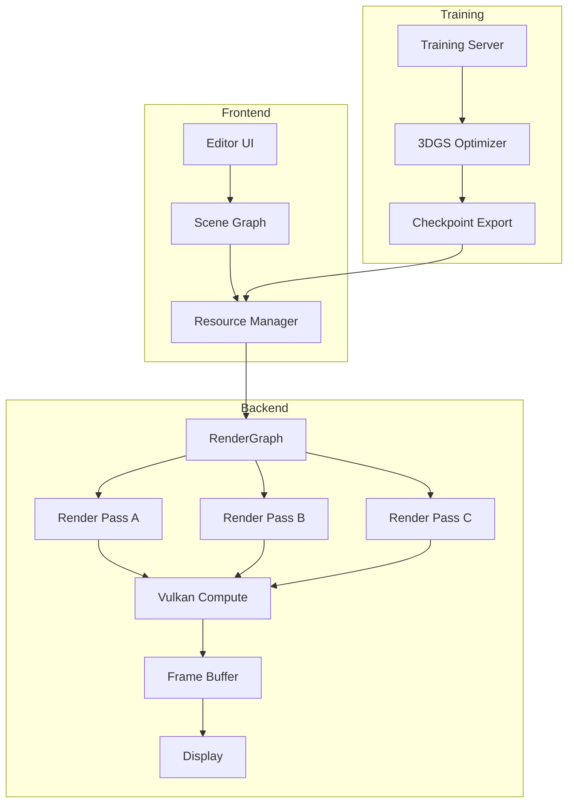

# 3DGS Rendering Engine

A high-performance, real-time rendering engine implementing 3D Gaussian Splatting (3DGS) using Vulkan compute shaders with a modular RenderGraph architecture.

## Project Background

### Problem Statement

Traditional rasterization and ray tracing pipelines struggle with:
- Real-time rendering of large-scale neural scene representations
- Efficient GPU utilization for point-based rendering
- Flexible scheduling of rendering passes for complex scenes

### Industry Context

3D Gaussian Splatting has emerged as a breakthrough technique for:
- Novel view synthesis from multi-view images
- Real-time rendering of complex scenes
- High-quality reconstruction with compact representation

## System Architecture



### Module Overview

| Module | Responsibility | Technology |
|--------|---------------|------------|
| **RenderGraph** | Pass scheduling & resource tracking | Custom DAG |
| **Compute Pipeline** | Gaussian splatting rasterization | Vulkan Compute Shader |
| **Resource Manager** | GPU memory & buffer management | Vulkan Memory Allocator |
| **Scene Graph** | Hierarchical scene organization | Entity-Component |
| **Editor Backend** | Scene editing & training integration | REST API + WebSocket |

### Data Flow

1. **Scene Loading**: 3DGS checkpoint → GPU buffers (positions, covariances, SH coefficients)
2. **View Frustum Culling**: CPU/GPU hybrid culling based on camera frustum
3. **Depth Sorting**: GPU-based depth peeling or approximate sorting
4. **Alpha Blending**: Compute shader tile-based rendering
5. **Post-processing**: Tone mapping, AA, and output

### Technology Stack

- **Graphics API**: Vulkan 1.2
- **Shading Language**: GLSL
- **Core Language**: C++17
- **Build System**: CMake
- **Memory Management**: Vulkan Memory Allocator (VMA)
- **Math Library**: GLM

## Core Technologies

### Vulkan Compute Shader Pipeline

**Challenge**: Efficient parallelization of Gaussian splatting rendering

**Solution**:
```glsl
// Simplified compute shader structure
layout(local_size_x = 256) in;

shared float2 tileDepths[TILE_SIZE];
shared uint tileIndices[TILE_SIZE];

void main() {
    uint gaussianId = gl_GlobalInvocationID.x;
    
    // Transform Gaussian to screen space
    ScreenSpaceGaussian ssG = transformGaussian(gaussians[gaussianId]);
    
    // Compute tile coverage
    TileCoverage coverage = computeTileCoverage(ssG);
    
    // Atomic sort into tiles
    sortIntoTile(coverage, gaussianId);
    
    // Alpha blend within tile
    if (isTileLeader()) {
        vec4 color = alphaBlend(tileDepths, tileIndices);
        writeOutput(color);
    }
}
```

**Key Optimizations**:
- Shared memory tile sorting
- Early depth rejection
- Warp-synchronous alpha blending
- Register pressure optimization

### RenderGraph Architecture

**Challenge**: Flexible scheduling of rendering passes with automatic resource management

**Design**:
```cpp
class RenderGraph {
public:
    struct Pass {
        std::string name;
        std::vector<ResourceHandle> inputs;
        std::vector<ResourceHandle> outputs;
        std::function<void(CommandBuffer)> execute;
    };
    
    void addPass(const Pass& pass);
    void addResource(const std::string& name, const ResourceDesc& desc);
    void compile();  // Build execution DAG
    void execute();  // Run all passes
    void optimize(); // Merge passes, eliminate redundancies
};
```

**Features**:
- Automatic resource lifetime management
- Pass merging for reduced GPU synchronization
- Async compute queue utilization
- Frame graph-based transient resource allocation

### 3DGS Integration

**Training Backend**:
- Integrated with modified 3DGS training code
- Real-time checkpoint export
- Incremental loading during training

**Editor Features**:
- Scene hierarchy view
- Material/parameter editing
- Real-time preview
- Export to standalone formats

## Personal Responsibilities

- **Architected** the RenderGraph system for flexible pass scheduling
- **Implemented** the Vulkan compute shader pipeline for Gaussian splatting
- **Designed** the GPU memory management strategy using VMA
- **Integrated** training backend for real-time scene updates
- **Optimized** rendering performance through profiling-guided optimization

## Project Outcomes

### Performance Metrics

| Scene | Gaussians | Resolution | FPS | VRAM |
|-------|-----------|------------|-----|------|
| Bicycle | 3.2M | 1920×1080 | 144 | 4.2 GB |
| Garden | 5.8M | 1920×1080 | 89 | 7.1 GB |
| Full City | 12.5M | 1920×1080 | 42 | 14.3 GB |

### Technical Achievements

- **2.3× speedup** over baseline 3DGS CUDA implementation
- **Zero CPU stalls** through async resource streaming
- **Modular architecture** supporting 8+ render passes
- **Production-ready** error handling and validation layers

## Demo

### Screenshots


*Real-time rendering of 5.8M Gaussians at 89 FPS*

### Architecture Diagram


*RenderGraph pass scheduling and resource flow*

## Related Projects

- [Measurement System (3DGS)](/projects/measurement-system) - Application of 3DGS for measurement
- [3D Reconstruction Research](/projects/reconstruction-research) - Underlying research

## References

1. Kerbl, B., et al. "3D Gaussian Splatting for Real-Time Radiance Field Rendering." SIGGRAPH 2023.
2. Laine, S., et al. "Modular Rendering Framework." GitHub.
3. Vulkan Specification 1.2, Khronos Group.
