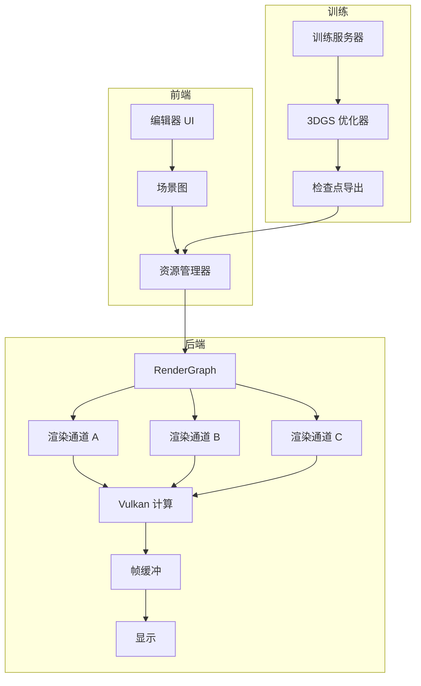

# 3DGS 渲染引擎

高性能实时渲染引擎，使用 Vulkan 计算着色器实现 3D 高斯泼溅（3DGS），采用模块化 RenderGraph 架构。

## 项目背景

### 问题陈述

传统光栅化和光线追踪管线面临以下挑战：
- 大规模神经场景表示的实时渲染
- 基于点的渲染的高效 GPU 利用
- 复杂场景渲染通道调度的灵活性

### 行业背景

3D 高斯泼溅已成为突破性技术：
- 从多视图图像进行新视角合成
- 复杂场景的实时渲染
- 紧凑表示的高质量重建

## 系统架构



### 模块概述

| 模块 | 职责 | 技术 |
|------|------|------|
| **RenderGraph** | 通道调度和资源跟踪 | 自定义 DAG |
| **计算管线** | 高斯泼溅光栅化 | Vulkan 计算着色器 |
| **资源管理器** | GPU 内存和缓冲区管理 | Vulkan Memory Allocator |
| **场景图** | 层次化场景组织 | 实体 - 组件 |
| **编辑器后端** | 场景编辑和训练集成 | REST API + WebSocket |

### 数据流

1. **场景加载**: 3DGS 检查点 → GPU 缓冲区（位置、协方差、SH 系数）
2. **视锥体剔除**: 基于相机视锥体的 CPU/GPU 混合剔除
3. **深度排序**: GPU 基础深度剥离或近似排序
4. **Alpha 混合**: 计算着色器基于图块的渲染
5. **后处理**: 色调映射、抗锯齿和输出

### 技术栈

- **图形 API**: Vulkan 1.2
- **着色语言**: GLSL
- **核心语言**: C++17
- **构建系统**: CMake
- **内存管理**: Vulkan Memory Allocator (VMA)
- **数学库**: GLM

## 核心技术

### Vulkan 计算着色器管线

**挑战**: 高斯泼溅渲染的高效并行化

**解决方案**:
```glsl
// 简化的计算着色器结构
layout(local_size_x = 256) in;

shared float2 tileDepths[TILE_SIZE];
shared uint tileIndices[TILE_SIZE];

void main() {
    uint gaussianId = gl_GlobalInvocationID.x;
    
    // 将高斯变换到屏幕空间
    ScreenSpaceGaussian ssG = transformGaussian(gaussians[gaussianId]);
    
    // 计算图块覆盖
    TileCoverage coverage = computeTileCoverage(ssG);
    
    // 原子排序到图块
    sortIntoTile(coverage, gaussianId);
    
    // 图块内 Alpha 混合
    if (isTileLeader()) {
        vec4 color = alphaBlend(tileDepths, tileIndices);
        writeOutput(color);
    }
}
```

**关键优化**:
- 共享内存图块排序
- 早期深度拒绝
- Warp 同步 Alpha 混合
- 寄存器压力优化

### RenderGraph 架构

**挑战**: 灵活调度渲染通道并自动管理资源

**设计**:
```cpp
class RenderGraph {
public:
    struct Pass {
        std::string name;
        std::vector<ResourceHandle> inputs;
        std::vector<ResourceHandle> outputs;
        std::function<void(CommandBuffer)> execute;
    };
    
    void addPass(const Pass& pass);
    void addResource(const std::string& name, const ResourceDesc& desc);
    void compile();  // 构建执行 DAG
    void execute();  // 运行所有通道
    void optimize(); // 合并通道，消除冗余
};
```

**特性**:
- 自动资源生命周期管理
- 通道合并减少 GPU 同步
- 异步计算队列利用
- 基于帧图的瞬态资源分配

### 3DGS 集成

**训练后端**:
- 集成修改的 3DGS 训练代码
- 实时检查点导出
- 训练期间增量加载

**编辑器功能**:
- 场景层次视图
- 材质/参数编辑
- 实时预览
- 导出为独立格式

## 个人职责

- **架构设计** RenderGraph 系统用于灵活的通道调度
- **实现** Vulkan 计算着色器管线用于高斯泼溅
- **设计** 使用 VMA 的 GPU 内存管理策略
- **集成** 训练后端用于实时场景更新
- **优化** 通过性能分析指导的渲染优化

## 项目成果

### 性能指标

| 场景 | 高斯数量 | 分辨率 | FPS | 显存 |
|------|----------|--------|-----|------|
| 自行车 | 320 万 | 1920×1080 | 144 | 4.2 GB |
| 花园 | 580 万 | 1920×1080 | 89 | 7.1 GB |
| 完整城市 | 1250 万 | 1920×1080 | 42 | 14.3 GB |

### 技术成就

- 相比基线 3DGS CUDA 实现**2.3 倍加速**
- 通过异步资源流实现**零 CPU 停滞**
- **模块化架构**支持 8+ 渲染通道
- **生产就绪**的错误处理和验证层

## 演示

### 截图


*580 万高斯点实时渲染，89 FPS*

### 架构图


*RenderGraph 通道调度和资源流*

## 画廊

<div class="gallery-grid">

<div class="gallery-item">
  <div class="gallery-image-wrapper">
    
  </div>
  <div class="gallery-info">
    <h4>实时渲染演示</h4>
    <p>580 万高斯点，89 FPS</p>
  </div>
</div>

<div class="gallery-item">
  <div class="gallery-image-wrapper">
    
  </div>
  <div class="gallery-info">
    <h4>系统架构</h4>
    <p>RenderGraph 数据流</p>
  </div>
</div>

</div>

## 相关项目

- [测量系统 (3DGS)](/projects/measurement-system) - 3DGS 的应用
- [三维重建研究](/projects/reconstruction-research) - 基础研究

## 参考文献

1. Kerbl, B., et al. "3D Gaussian Splatting for Real-Time Radiance Field Rendering." SIGGRAPH 2023.
2. Laine, S., et al. "Modular Rendering Framework." GitHub.
3. Vulkan Specification 1.2, Khronos Group.

<style>
.gallery-grid {
  display: grid;
  grid-template-columns: repeat(auto-fit, minmax(280px, 1fr));
  gap: 1.5rem;
  margin: 2rem 0;
}

.gallery-item {
  border-radius: 12px;
  overflow: hidden;
  background-color: var(--vp-c-bg-elv);
  border: 1px solid var(--vp-c-divider);
  transition: all 0.3s ease;
}

.gallery-item:hover {
  border-color: var(--vp-c-brand);
  box-shadow: 0 8px 24px rgba(0, 0, 0, 0.12);
  transform: translateY(-4px);
}

.gallery-image-wrapper {
  position: relative;
  width: 100%;
  padding-top: 56.25%;
  overflow: hidden;
  background-color: var(--vp-c-bg-alt);
}

.gallery-image {
  position: absolute;
  top: 0;
  left: 0;
  width: 100%;
  height: 100%;
  object-fit: cover;
  transition: transform 0.3s ease;
}

.gallery-item:hover .gallery-image {
  transform: scale(1.05);
}

.gallery-info {
  padding: 1.25rem;
}

.gallery-info h4 {
  margin: 0 0 0.5rem 0;
  font-size: 1.1rem;
  color: var(--vp-c-brand);
}

.gallery-info p {
  margin: 0;
  font-size: 0.9rem;
  color: var(--vp-c-text-2);
  line-height: 1.5;
}
</style>
