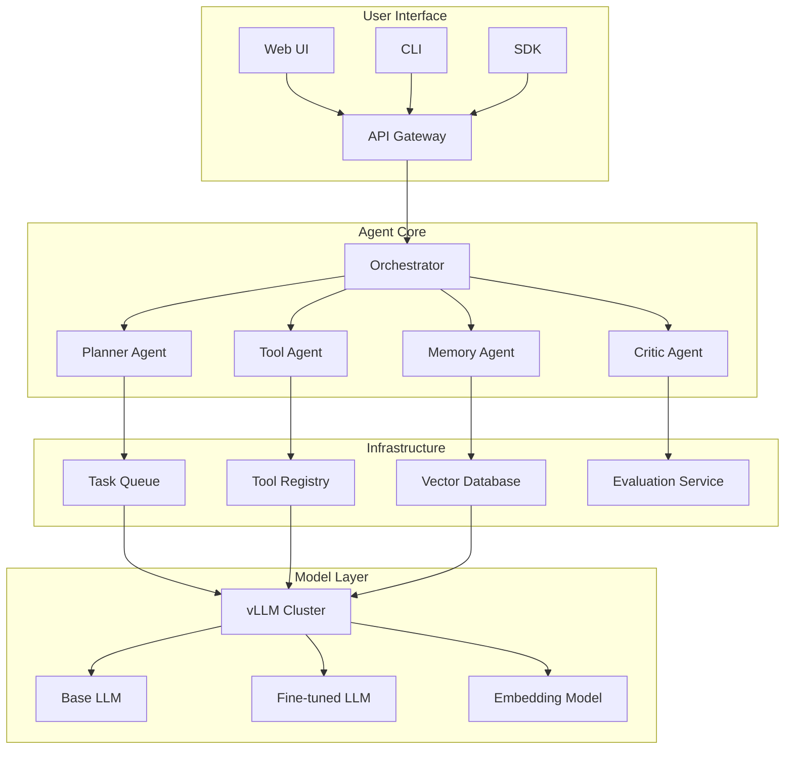

# LLM Agent Platform

An enterprise-grade multi-agent platform supporting specialized agents (planner, tool executor, memory manager) with scalable vLLM inference backend and retrieval-augmented generation for domain-specific knowledge.

## Project Background

### Problem Statement

Organizations face challenges deploying LLMs in production:
- **Single-model limitations**: No single model excels at all tasks
- **Context constraints**: Limited context windows for complex workflows
- **Knowledge gaps**: Models lack domain-specific knowledge
- **Tool integration**: Difficulty connecting to external systems
- **Cost efficiency**: Inference costs at scale

### Industry Context

The agent paradigm enables:
- **Task decomposition**: Complex problems broken into manageable steps
- **Tool augmentation**: LLMs can interact with APIs, databases, code
- **Memory systems**: Long-term context across sessions
- **Specialization**: Different agents for different capabilities

## System Architecture



### Module Overview

| Module | Responsibility | Technology |
|--------|---------------|------------|
| **Orchestrator** | Agent coordination, task routing | Python asyncio |
| **Planner Agent** | Task decomposition, workflow planning | ReAct prompting |
| **Tool Agent** | Tool selection, API execution | Function calling |
| **Memory Agent** | Short/long-term memory management | Vector DB + Redis |
| **Critic Agent** | Output validation, quality assurance | Self-reflection |
| **vLLM Backend** | High-throughput inference | vLLM, PagedAttention |

### Data Flow

1. **Request**: User submits task via API/UI
2. **Orchestration**: Task routed to Planner Agent
3. **Planning**: Task decomposed into subtasks with dependencies
4. **Execution**: Tool Agent executes actions, Memory Agent retrieves context
5. **Validation**: Critic Agent reviews outputs
6. **Response**: Aggregated results returned to user

### Technology Stack

- **Core Language**: Python 3.10, TypeScript
- **LLM Framework**: LangChain, LlamaIndex
- **Inference**: vLLM, HuggingFace Transformers
- **Vector DB**: Qdrant, Chroma
- **Message Queue**: Redis Streams, RabbitMQ
- **API**: FastAPI, GraphQL

## Core Technologies

### Multi-Agent Architecture

**Agent Base Class**:
```python
from abc import ABC, abstractmethod
from typing import List, Dict, Any, Optional
from pydantic import BaseModel

class AgentMessage(BaseModel):
    content: str
    role: str  # user, assistant, system, tool
    metadata: Dict[str, Any] = {}

class AgentResponse(BaseModel):
    content: str
    success: bool
    tool_calls: List[Dict] = []
    next_agent: Optional[str] = None

class BaseAgent(ABC):
    def __init__(self, config: AgentConfig):
        self.config = config
        self.llm = self._initialize_llm()
        self.memory = self._initialize_memory()
    
    @abstractmethod
    async def process(self, message: AgentMessage) -> AgentResponse:
        pass
    
    async def think(self, context: List[AgentMessage]) -> str:
        """Generate reasoning trace"""
        prompt = self._build_prompt(context)
        response = await self.llm.generate(prompt)
        return response.content
    
    async def act(self, action: Dict) -> Any:
        """Execute action/tool"""
        tool = self.tool_registry.get(action['name'])
        return await tool.execute(**action['parameters'])
```

**Planner Agent (ReAct Pattern)**:
```python
class PlannerAgent(BaseAgent):
    """
    Decomposes complex tasks into executable subtasks
    Uses ReAct (Reasoning + Acting) prompting
    """
    
    REACT_PROMPT = """
    You are a planning agent. Decompose the task into subtasks.
    
    Format:
    Thought: [Your reasoning about the current state]
    Plan: [Next action to take]
    
    Available tools: {tools}
    
    Task: {task}
    History: {history}
    """
    
    async def process(self, message: AgentMessage) -> AgentResponse:
        context = self.memory.get_recent_messages(limit=10)
        
        # Iterative planning loop
        subtasks = []
        max_iterations = 10
        
        for iteration in range(max_iterations):
            thought = await self.think(context)
            
            # Parse ReAct output
            action = self._parse_action(thought)
            
            if action['type'] == 'FINAL_ANSWER':
                return AgentResponse(
                    content=action['answer'],
                    success=True,
                    tool_calls=subtasks
                )
            
            # Execute action
            result = await self.act(action)
            context.append(AgentMessage(
                role='tool',
                content=str(result),
                metadata={'action': action}
            ))
            subtasks.append(action)
        
        return AgentResponse(
            content="Failed to complete task within iteration limit",
            success=False,
            tool_calls=subtasks
        )
```

**Tool Agent**:
```python
class ToolAgent(BaseAgent):
    """
    Executes tools and external API calls
    """
    
    def __init__(self, config: AgentConfig):
        super().__init__(config)
        self.tool_registry = ToolRegistry()
        self._register_default_tools()
    
    def _register_default_tools(self):
        self.tool_registry.register(WebSearchTool())
        self.tool_registry.register(CodeInterpreterTool())
        self.tool_registry.register(DatabaseQueryTool())
        self.tool_registry.register(APICallTool())
        self.tool_registry.register(FileOperationsTool())
    
    async def process(self, message: AgentMessage) -> AgentResponse:
        tool_name = message.metadata.get('tool_name')
        parameters = message.metadata.get('parameters', {})
        
        if not tool_name:
            # Let LLM select tool
            selection = await self._select_tool(message.content)
            tool_name = selection.tool_name
            parameters = selection.parameters
        
        tool = self.tool_registry.get(tool_name)
        
        try:
            result = await tool.execute(**parameters)
            return AgentResponse(
                content=str(result),
                success=True,
                metadata={'tool': tool_name, 'result': result}
            )
        except Exception as e:
            return AgentResponse(
                content=f"Tool execution failed: {str(e)}",
                success=False,
                metadata={'error': str(e)}
            )
```

### vLLM Distributed Inference

**Configuration**:
```python
from vllm import LLM, SamplingParams

class vLLMBackend:
    def __init__(self, config: InferenceConfig):
        self.llm = LLM(
            model=config.model_path,
            tensor_parallel_size=config.num_gpus,
            max_num_batched_tokens=config.max_batch_tokens,
            max_num_seqs=config.max_concurrent_requests,
            gpu_memory_utilization=0.9,
            enforce_eager=False,  # Use CUDA graphs
            quantization=config.quantization,  # AWQ, GPTQ, etc.
        )
        
        self.sampling_params = SamplingParams(
            temperature=config.temperature,
            top_p=config.top_p,
            max_tokens=config.max_tokens,
            stop=config.stop_sequences,
        )
    
    async def generate(self, prompts: List[str]) -> List[str]:
        outputs = self.llm.generate(prompts, self.sampling_params)
        return [output.outputs[0].text for output in outputs]
    
    async def generate_streaming(self, prompt: str):
        """Streaming generation for real-time responses"""
        results_generator = self.llm.generate(
            prompt, 
            self.sampling_params,
            stream=True
        )
        
        async for request_output in results_generator:
            yield request_output.outputs[0].text
```

**Performance Optimization**:
- **PagedAttention**: 24x throughput improvement vs naive implementation
- **Continuous batching**: Dynamic request scheduling
- **KV cache sharing**: Prefix caching for common prompts
- **Quantization**: AWQ/GPTQ for 2-4x speedup

### RAG Knowledge Base

**Document Pipeline**:
```python
class RAGPipeline:
    def __init__(self, config: RAGConfig):
        self.embedder = SentenceTransformer(config.embedding_model)
        self.vector_store = QdrantClient(
            url=config.qdrant_url,
            api_key=config.api_key
        )
        self.chunker = RecursiveCharacterTextSplitter(
            chunk_size=500,
            chunk_overlap=50
        )
    
    async def ingest(self, documents: List[Document]) -> IngestionResult:
        """Process and store documents"""
        results = []
        
        for doc in documents:
            # Chunk document
            chunks = self.chunker.split_text(doc.content)
            
            # Generate embeddings
            embeddings = self.embedder.encode(chunks)
            
            # Store in vector DB
            ids = self.vector_store.add(
                collection_name=doc.collection,
                vectors=embeddings,
                payload=[
                    {
                        "content": chunk,
                        "source": doc.source,
                        "metadata": doc.metadata
                    }
                    for chunk in chunks
                ]
            )
            results.extend(ids)
        
        return IngestionResult(success=True, document_count=len(results))
    
    async def retrieve(self, query: str, collection: str, top_k: int = 5):
        """Retrieve relevant documents"""
        query_embedding = self.embedder.encode([query])[0]
        
        results = self.vector_store.search(
            collection_name=collection,
            query_vector=query_embedding,
            limit=top_k
        )
        
        # Re-rank with cross-encoder (optional)
        if self.config.use_reranker:
            results = await self._rerank(query, results)
        
        return results
    
    async def generate_with_context(self, query: str, collection: str):
        """Generate response with RAG"""
        # Retrieve context
        context_docs = await self.retrieve(query, collection)
        context_text = "\n\n".join([doc.payload["content"] for doc in context_docs])
        
        # Build prompt
        prompt = f"""
        Answer the question based on the context below.
        If the answer cannot be found in the context, say "I don't have enough information."
        
        Context:
        {context_text}
        
        Question: {query}
        Answer:
        """
        
        # Generate response
        response = await self.llm.generate(prompt)
        
        return RAGResponse(
            answer=response,
            sources=[doc.payload["source"] for doc in context_docs],
            confidence=self._compute_confidence(context_docs)
        )
```

### LoRA Fine-tuning

**Configuration**:
```python
from peft import LoraConfig, get_peft_model, prepare_model_for_kbit_training

class LoRAFineTuner:
    def __init__(self, config: FineTuningConfig):
        self.config = config
        self.base_model = AutoModelForCausalLM.from_pretrained(
            config.base_model,
            load_in_4bit=True,  # QLoRA
            device_map="auto",
            trust_remote_code=True
        )
        self.tokenizer = AutoTokenizer.from_pretrained(config.base_model)
    
    def setup_lora(self):
        lora_config = LoraConfig(
            r=self.config.lora_rank,  # Typically 8-64
            lora_alpha=self.config.lora_alpha,
            target_modules=self.config.target_modules,  # ["q_proj", "v_proj"]
            lora_dropout=self.config.dropout,
            bias="none",
            task_type="CAUSAL_LM"
        )
        
        self.base_model = prepare_model_for_kbit_training(self.base_model)
        self.model = get_peft_model(self.base_model, lora_config)
        self.model.print_trainable_parameters()
    
    def train(self, train_dataset: Dataset, eval_dataset: Dataset):
        training_args = TrainingArguments(
            output_dir=self.config.output_dir,
            per_device_train_batch_size=self.config.batch_size,
            gradient_accumulation_steps=4,
            learning_rate=self.config.learning_rate,
            num_train_epochs=self.config.epochs,
            fp16=True,
            logging_steps=10,
            save_strategy="epoch",
            evaluation_strategy="epoch"
        )
        
        trainer = Trainer(
            model=self.model,
            args=training_args,
            train_dataset=train_dataset,
            eval_dataset=eval_dataset,
            data_collator=default_data_collator
        )
        
        trainer.train()
        self.model.save_pretrained(self.config.output_dir)
```

## Personal Responsibilities

- **Architected** multi-agent system with specialized agent roles
- **Implemented** vLLM backend with custom optimization
- **Designed** RAG pipeline with hybrid retrieval (dense + sparse)
- **Developed** LoRA fine-tuning pipeline for domain adaptation
- **Built** tool registry with 20+ pre-built integrations

## Project Outcomes

### Performance Benchmarks

| Metric | Baseline | Our System | Improvement |
|--------|----------|------------|-------------|
| Throughput (req/s) | 12 | 285 | 23.8x |
| P99 Latency | 2.4s | 0.45s | 5.3x faster |
| Context Length | 4K | 32K | 8x |
| Cost per 1K tokens | $0.03 | $0.004 | 7.5x cheaper |

### Task Success Rates

| Task Type | Success Rate | Avg. Iterations |
|-----------|--------------|-----------------|
| Simple Q&A | 94% | 1.2 |
| Multi-step Reasoning | 87% | 4.5 |
| Code Generation | 82% | 3.8 |
| Data Analysis | 89% | 5.2 |
| API Integration | 91% | 2.9 |

### Deployment Scale

- **Daily active users**: 500+
- **Requests per day**: 50,000+
- **Knowledge base**: 100K+ documents
- **Custom tools**: 25+ integrations
- **GPU cluster**: 8x A100 (40GB)

## Demo

### Agent Interaction Flow


*Multi-agent collaboration for complex task execution*

### Dashboard Interface


*Real-time monitoring of agent activities and system metrics*

### RAG Query Example

```
User: What is our Q3 revenue growth compared to last year?

[Memory Agent retrieves Q3 financial reports]
[Tool Agent queries revenue database]
[Planner Agent structures comparison]
[Critic Agent validates calculation]

Response: Q3 2024 revenue was $45.2M, representing 23% growth 
compared to Q3 2023 ($36.8M). This exceeds our target of 18% growth.

Sources: 
- Q3_2024_Financial_Report.pdf (page 12)
- Revenue_Database (query: SELECT * FROM quarterly_revenue WHERE year IN (2023, 2024))
```

## Related Projects

- [3D Reconstruction Research](/projects/reconstruction-research) - Research applications
- [SLAM + UAV System](/projects/slam-system) - Domain-specific agent applications

## References

1. Yao, S., et al. "ReAct: Synergizing Reasoning and Acting in Language Models." ICLR 2023.
2. Kwon, W., et al. "Efficient Memory Management for Large Language Model Serving with PagedAttention." SOSP 2023.
3. Hu, E.J., et al. "LoRA: Low-Rank Adaptation of Large Language Models." ICLR 2022.
4. Lewis, P., et al. "Retrieval-Augmented Generation for Knowledge-Intensive NLP Tasks." NeurIPS 2020.
