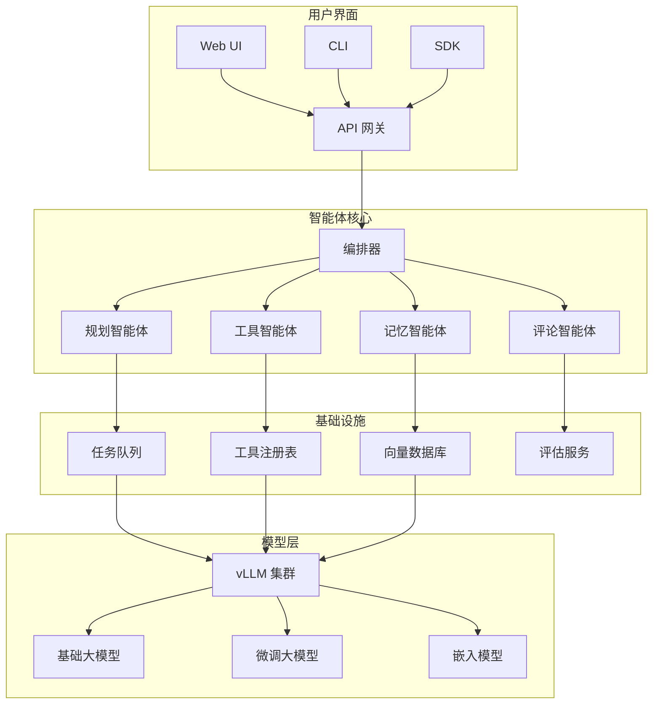

# 大模型 Agent 平台

企业级多智能体平台，支持专用智能体（规划器、工具执行器、记忆管理器），具有可扩展的 vLLM 推理后端和检索增强生成领域知识。

## 项目背景

### 问题陈述

组织在生产环境中部署大模型面临挑战：
- **单模型限制**: 没有单一模型擅长所有任务
- **上下文约束**: 有限上下文窗口处理复杂工作流
- **知识差距**: 模型缺乏领域特定知识
- **工具集成**: 难以连接到外部系统
- **成本效率**: 规模化推理成本

### 行业背景

智能体范式实现：
- **任务分解**: 复杂问题拆分为可管理步骤
- **工具增强**: 大模型可以与 API、数据库、代码交互
- **记忆系统**: 跨会话长期上下文
- **专业化**: 不同智能体处理不同能力

## 系统架构



### 模块概述

| 模块 | 职责 | 技术 |
|------|------|------|
| **编排器** | 智能体协调、任务路由 | Python asyncio |
| **规划智能体** | 任务分解、工作流规划 | ReAct 提示 |
| **工具智能体** | 工具选择、API 执行 | 函数调用 |
| **记忆智能体** | 短/长期记忆管理 | 向量 DB + Redis |
| **评论智能体** | 输出验证、质量保证 | 自反思 |
| **vLLM 后端** | 高吞吐推理 | vLLM, PagedAttention |

### 数据流

1. **请求**: 用户通过 API/UI 提交任务
2. **编排**: 任务路由到规划智能体
3. **规划**: 任务分解为带依赖关系的子任务
4. **执行**: 工具智能体执行动作，记忆智能体检索上下文
5. **验证**: 评论智能体审查输出
6. **响应**: 聚合结果返回给用户

### 技术栈

- **核心语言**: Python 3.10, TypeScript
- **大模型框架**: LangChain, LlamaIndex
- **推理**: vLLM, HuggingFace Transformers
- **向量 DB**: Qdrant, Chroma
- **消息队列**: Redis Streams, RabbitMQ
- **API**: FastAPI, GraphQL

## 核心技术

### 多智能体架构

**智能体基类**:
```python
from abc import ABC, abstractmethod
from typing import List, Dict, Any, Optional
from pydantic import BaseModel

class AgentMessage(BaseModel):
    content: str
    role: str  # user, assistant, system, tool
    metadata: Dict[str, Any] = {}

class AgentResponse(BaseModel):
    content: str
    success: bool
    tool_calls: List[Dict] = []
    next_agent: Optional[str] = None

class BaseAgent(ABC):
    def __init__(self, config: AgentConfig):
        self.config = config
        self.llm = self._initialize_llm()
        self.memory = self._initialize_memory()
    
    @abstractmethod
    async def process(self, message: AgentMessage) -> AgentResponse:
        pass
    
    async def think(self, context: List[AgentMessage]) -> str:
        """生成推理轨迹"""
        prompt = self._build_prompt(context)
        response = await self.llm.generate(prompt)
        return response.content
    
    async def act(self, action: Dict) -> Any:
        """执行动作/工具"""
        tool = self.tool_registry.get(action['name'])
        return await tool.execute(**action['parameters'])
```

**规划智能体（ReAct 模式）**:
```python
class PlannerAgent(BaseAgent):
    """
    将复杂任务分解为可执行子任务
    使用 ReAct（推理 + 行动）提示
    """
    
    REACT_PROMPT = """
你是一个规划智能体。将任务分解为子任务。

格式：
Thought: [你对当前状态的推理]
Plan: [要采取的下一步行动]

可用工具：{tools}

任务：{task}
历史：{history}
"""
    
    async def process(self, message: AgentMessage) -> AgentResponse:
        context = self.memory.get_recent_messages(limit=10)
        
        # 迭代规划循环
        subtasks = []
        max_iterations = 10
        
        for iteration in range(max_iterations):
            thought = await self.think(context)
            
            # 解析 ReAct 输出
            action = self._parse_action(thought)
            
            if action['type'] == 'FINAL_ANSWER':
                return AgentResponse(
                    content=action['answer'],
                    success=True,
                    tool_calls=subtasks
                )
            
            # 执行动作
            result = await self.act(action)
            context.append(AgentMessage(
                role='tool',
                content=str(result),
                metadata={'action': action}
            ))
            subtasks.append(action)
        
        return AgentResponse(
            content="未能在迭代限制内完成任务",
            success=False,
            tool_calls=subtasks
        )
```

**工具智能体**:
```python
class ToolAgent(BaseAgent):
    """
    执行工具和外部 API 调用
    """
    
    def __init__(self, config: AgentConfig):
        super().__init__(config)
        self.tool_registry = ToolRegistry()
        self._register_default_tools()
    
    def _register_default_tools(self):
        self.tool_registry.register(WebSearchTool())
        self.tool_registry.register(CodeInterpreterTool())
        self.tool_registry.register(DatabaseQueryTool())
        self.tool_registry.register(APICallTool())
        self.tool_registry.register(FileOperationsTool())
    
    async def process(self, message: AgentMessage) -> AgentResponse:
        tool_name = message.metadata.get('tool_name')
        parameters = message.metadata.get('parameters', {})
        
        if not tool_name:
            # 让大模型选择工具
            selection = await self._select_tool(message.content)
            tool_name = selection.tool_name
            parameters = selection.parameters
        
        tool = self.tool_registry.get(tool_name)
        
        try:
            result = await tool.execute(**parameters)
            return AgentResponse(
                content=str(result),
                success=True,
                metadata={'tool': tool_name, 'result': result}
            )
        except Exception as e:
            return AgentResponse(
                content=f"工具执行失败：{str(e)}",
                success=False,
                metadata={'error': str(e)}
            )
```

### vLLM 分布式推理

**配置**:
```python
from vllm import LLM, SamplingParams

class vLLMBackend:
    def __init__(self, config: InferenceConfig):
        self.llm = LLM(
            model=config.model_path,
            tensor_parallel_size=config.num_gpus,
            max_num_batched_tokens=config.max_batch_tokens,
            max_num_seqs=config.max_concurrent_requests,
            gpu_memory_utilization=0.9,
            enforce_eager=False,  # 使用 CUDA 图
            quantization=config.quantization,  # AWQ, GPTQ 等
        )
        
        self.sampling_params = SamplingParams(
            temperature=config.temperature,
            top_p=config.top_p,
            max_tokens=config.max_tokens,
            stop=config.stop_sequences,
        )
    
    async def generate(self, prompts: List[str]) -> List[str]:
        outputs = self.llm.generate(prompts, self.sampling_params)
        return [output.outputs[0].text for output in outputs]
    
    async def generate_streaming(self, prompt: str):
        """流式生成用于实时响应"""
        results_generator = self.llm.generate(
            prompt, 
            self.sampling_params,
            stream=True
        )
        
        async for request_output in results_generator:
            yield request_output.outputs[0].text
```

**性能优化**:
- **PagedAttention**: 相比朴素实现 24 倍吞吐提升
- **连续批处理**: 动态请求调度
- **KV 缓存共享**: 常见提示前缀缓存
- **量化**: AWQ/GPTQ 实现 2-4 倍加速

### RAG 知识库

**文档管线**:
```python
class RAGPipeline:
    def __init__(self, config: RAGConfig):
        self.embedder = SentenceTransformer(config.embedding_model)
        self.vector_store = QdrantClient(
            url=config.qdrant_url,
            api_key=config.api_key
        )
        self.chunker = RecursiveCharacterTextSplitter(
            chunk_size=500,
            chunk_overlap=50
        )
    
    async def ingest(self, documents: List[Document]) -> IngestionResult:
        """处理和存储文档"""
        results = []
        
        for doc in documents:
            # 分块文档
            chunks = self.chunker.split_text(doc.content)
            
            # 生成嵌入
            embeddings = self.embedder.encode(chunks)
            
            # 存储到向量数据库
            ids = self.vector_store.add(
                collection_name=doc.collection,
                vectors=embeddings,
                payload=[
                    {
                        "content": chunk,
                        "source": doc.source,
                        "metadata": doc.metadata
                    }
                    for chunk in chunks
                ]
            )
            results.extend(ids)
        
        return IngestionResult(success=True, document_count=len(results))
    
    async def retrieve(self, query: str, collection: str, top_k: int = 5):
        """检索相关文档"""
        query_embedding = self.embedder.encode([query])[0]
        
        results = self.vector_store.search(
            collection_name=collection,
            query_vector=query_embedding,
            limit=top_k
        )
        
        # 使用交叉编码器重新排序（可选）
        if self.config.use_reranker:
            results = await self._rerank(query, results)
        
        return results
    
    async def generate_with_context(self, query: str, collection: str):
        """使用 RAG 生成响应"""
        # 检索上下文
        context_docs = await self.retrieve(query, collection)
        context_text = "\n\n".join([doc.payload["content"] for doc in context_docs])
        
        # 构建提示
        prompt = f"""
根据以下上下文回答问题。
如果上下文中找不到答案，请说"我没有足够的信息"。

上下文：
{context_text}

问题：{query}
答案：
"""
        
        # 生成响应
        response = await self.llm.generate(prompt)
        
        return RAGResponse(
            answer=response,
            sources=[doc.payload["source"] for doc in context_docs],
            confidence=self._compute_confidence(context_docs)
        )
```

### LoRA 微调

**配置**:
```python
from peft import LoraConfig, get_peft_model, prepare_model_for_kbit_training

class LoRAFineTuner:
    def __init__(self, config: FineTuningConfig):
        self.config = config
        self.base_model = AutoModelForCausalLM.from_pretrained(
            config.base_model,
            load_in_4bit=True,  # QLoRA
            device_map="auto",
            trust_remote_code=True
        )
        self.tokenizer = AutoTokenizer.from_pretrained(config.base_model)
    
    def setup_lora(self):
        lora_config = LoraConfig(
            r=self.config.lora_rank,  # 通常 8-64
            lora_alpha=self.config.lora_alpha,
            target_modules=self.config.target_modules,  # ["q_proj", "v_proj"]
            lora_dropout=self.config.dropout,
            bias="none",
            task_type="CAUSAL_LM"
        )
        
        self.base_model = prepare_model_for_kbit_training(self.base_model)
        self.model = get_peft_model(self.base_model, lora_config)
        self.model.print_trainable_parameters()
    
    def train(self, train_dataset: Dataset, eval_dataset: Dataset):
        training_args = TrainingArguments(
            output_dir=self.config.output_dir,
            per_device_train_batch_size=self.config.batch_size,
            gradient_accumulation_steps=4,
            learning_rate=self.config.learning_rate,
            num_train_epochs=self.config.epochs,
            fp16=True,
            logging_steps=10,
            save_strategy="epoch",
            evaluation_strategy="epoch"
        )
        
        trainer = Trainer(
            model=self.model,
            args=training_args,
            train_dataset=train_dataset,
            eval_dataset=eval_dataset,
            data_collator=default_data_collator
        )
        
        trainer.train()
        self.model.save_pretrained(self.config.output_dir)
```

## 个人职责

- **架构设计** 多智能体系统与专用智能体角色
- **实现** vLLM 后端与自定义优化
- **设计** RAG 管线与混合检索（稠密 + 稀疏）
- **开发** LoRA 微调管线用于领域适配
- **构建** 工具注册表与 20+ 预建集成

## 项目成果

### 性能基准

| 指标 | 基线 | 本系统 | 提升 |
|------|------|--------|------|
| 吞吐量 (req/s) | 12 | 285 | 23.8 倍 |
| P99 延迟 | 2.4s | 0.45s | 5.3 倍更快 |
| 上下文长度 | 4K | 32K | 8 倍 |
| 每千 token 成本 | $0.03 | $0.004 | 7.5 倍更便宜 |

### 任务成功率

| 任务类型 | 成功率 | 平均迭代次数 |
|---------|--------|-------------|
| 简单问答 | 94% | 1.2 |
| 多步推理 | 87% | 4.5 |
| 代码生成 | 82% | 3.8 |
| 数据分析 | 89% | 5.2 |
| API 集成 | 91% | 2.9 |

### 部署规模

- **日活跃用户**: 500+
- **每日请求**: 50,000+
- **知识库**: 100K+ 文档
- **自定义工具**: 25+ 集成
- **GPU 集群**: 8x A100 (40GB)

## 演示

### 智能体交互流程


*复杂任务执行的多智能体协作*

### 仪表盘界面


*智能体活动和系统指标的实时监控*

### RAG 查询示例

```
用户：我们第三季度收入同比增长是多少？

[记忆智能体检索 Q3 财务报告]
[工具智能体查询收入数据库]
[规划智能体构建对比]
[评论智能体验证计算]

响应：2024 年 Q3 收入为 4520 万元，相比 2023 年 Q3（3680 万元）
增长 23%。超过我们 18% 的增长目标。

来源：
- Q3_2024_Financial_Report.pdf（第 12 页）
- 收入数据库（查询：SELECT * FROM quarterly_revenue WHERE year IN (2023, 2024)）
```

## 画廊

<div class="gallery-grid">

<div class="gallery-item">
  <div class="gallery-image-wrapper">
    
  </div>
  <div class="gallery-info">
    <h4>智能体协作</h4>
    <p>多智能体任务执行流程</p>
  </div>
</div>

<div class="gallery-item">
  <div class="gallery-image-wrapper">
    
  </div>
  <div class="gallery-info">
    <h4>监控仪表盘</h4>
    <p>实时系统监控</p>
  </div>
</div>

</div>

## 相关项目

- [三维重建研究](/projects/reconstruction-research) - 研究应用
- [SLAM + 无人机系统](/projects/slam-system) - 领域特定智能体应用

## 参考文献

1. Yao, S., et al. "ReAct: Synergizing Reasoning and Acting in Language Models." ICLR 2023.
2. Kwon, W., et al. "Efficient Memory Management for Large Language Model Serving with PagedAttention." SOSP 2023.
3. Hu, E.J., et al. "LoRA: Low-Rank Adaptation of Large Language Models." ICLR 2022.
4. Lewis, P., et al. "Retrieval-Augmented Generation for Knowledge-Intensive NLP Tasks." NeurIPS 2020.

<style>
.gallery-grid {
  display: grid;
  grid-template-columns: repeat(auto-fit, minmax(280px, 1fr));
  gap: 1.5rem;
  margin: 2rem 0;
}

.gallery-item {
  border-radius: 12px;
  overflow: hidden;
  background-color: var(--vp-c-bg-elv);
  border: 1px solid var(--vp-c-divider);
  transition: all 0.3s ease;
}

.gallery-item:hover {
  border-color: var(--vp-c-brand);
  box-shadow: 0 8px 24px rgba(0, 0, 0, 0.12);
  transform: translateY(-4px);
}

.gallery-image-wrapper {
  position: relative;
  width: 100%;
  padding-top: 56.25%;
  overflow: hidden;
  background-color: var(--vp-c-bg-alt);
}

.gallery-image {
  position: absolute;
  top: 0;
  left: 0;
  width: 100%;
  height: 100%;
  object-fit: cover;
  transition: transform 0.3s ease;
}

.gallery-item:hover .gallery-image {
  transform: scale(1.05);
}

.gallery-info {
  padding: 1.25rem;
}

.gallery-info h4 {
  margin: 0 0 0.5rem 0;
  font-size: 1.1rem;
  color: var(--vp-c-brand);
}

.gallery-info p {
  margin: 0;
  font-size: 0.9rem;
  color: var(--vp-c-text-2);
  line-height: 1.5;
}
</style>
