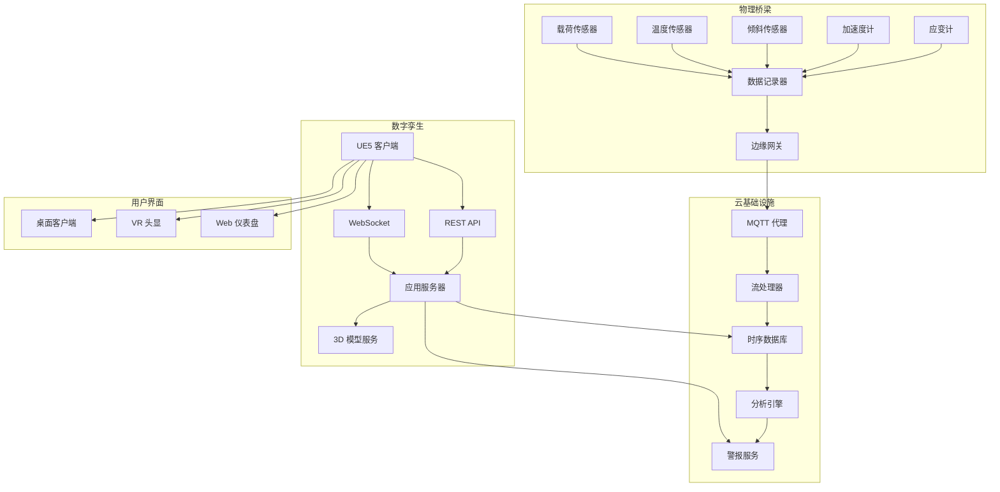

# 桥梁数字孪生 (UE)

基于 Unreal Engine 5 的工业数字孪生平台，集成实时 IoT 传感器数据流用于桥梁结构监测，具有高级可视化和警报系统。

## 项目背景

### 问题陈述

桥梁基础设施管理面临关键挑战：

- **数据孤岛**: 传感器数据分散在多个系统中
- **可视化受限**: 2D 仪表盘缺乏空间上下文
- **被动维护**: 问题在损坏后才被发现
- **利益相关者沟通**: 技术数据难以解释
- **历史分析**: 有限的趋势可视化能力

### 行业背景

数字孪生技术实现：

- **实时监控**: 实时传感器数据可视化
- **预测性维护**: AI 驱动的异常检测
- **沉浸式检查**: 虚拟桥梁游览
- **数据集成**: 所有监控数据的统一平台
- **决策支持**: 利益相关者的可视化分析

## 系统架构



### 模块概述

| 模块 | 职责 | 技术 |
|------|------|------|
| **IoT 网关** | 传感器数据摄入、协议转换 | MQTT, Modbus |
| **流处理器** | 实时数据处理、过滤 | Apache Kafka, Flink |
| **时序 DB** | 历史数据存储 | InfluxDB, TimescaleDB |
| **分析引擎** | 异常检测、趋势分析 | Python, scikit-learn |
| **UE5 客户端** | 3D 可视化、交互 | Unreal Engine 5, C++ |
| **警报服务** | 阈值监控、通知 | Redis, WebSocket |

### 数据流

1. **传感**: 传感器以 1-100 Hz 采样率收集数据
2. **传输**: 边缘网关通过 MQTT 发送数据到云端
3. **处理**: 流处理器验证、过滤、聚合
4. **存储**: 时序数据库存储历史数据
5. **可视化**: UE5 客户端在 3D 模型上渲染实时数据
6. **警报**: 系统触发阈值违规警报

### 技术栈

- **游戏引擎**: Unreal Engine 5.2
- **编程**: C++17, Python 3.10, Blueprints
- **IoT 协议**: MQTT, OPC-UA
- **数据库**: InfluxDB, PostgreSQL
- **流式传输**: Apache Kafka
- **云**: AWS IoT Core, Lambda, S3

## 核心技术

### IoT 数据集成

**MQTT 数据摄入**:

```cpp
// UE5 C++ - MQTT 客户端用于传感器数据
class UBridgeSensorManager : public UObject
{
    GENERATED_BODY()

public:
    struct FSensorData
    {
        FString SensorId;
        FString SensorType;  // Strain, Acceleration, Tilt, Temperature
        double Value;
        double Timestamp;
        FString Unit;
        TMap<FString, FString> Metadata;
    };

    UPROPERTY()
    TMap<FString, FSensorData> LatestSensorData;

    UPROPERTY()
    TMap<FString, TArray<FSensorData>> SensorHistory;

    void Initialize()
    {
        // 连接到 MQTT 代理
        MQTTClient = MakeShareable(new FMQTTClient);
        MQTTClient->OnMessageReceived.AddUObject(
            this, 
            &UBridgeSensorManager::HandleSensorMessage
        );
        
        // 订阅传感器主题
        MQTTClient->Subscribe("bridge/sensors/strain/#");
        MQTTClient->Subscribe("bridge/sensors/acceleration/#");
        MQTTClient->Subscribe("bridge/sensors/tilt/#");
        MQTTClient->Subscribe("bridge/sensors/temperature/#");
    }

    void HandleSensorMessage(const FMQTTMessage& Message)
    {
        // 解析 JSON 负载
        TSharedPtr<FJsonObject> JsonObject;
        TJsonReaderFactory<>::Create(Message.Payload);
        FJsonSerializer::Deserialize(JsonReader, JsonObject);

        FSensorData Data;
        Data.SensorId = JsonObject->GetStringField("sensor_id");
        Data.SensorType = JsonObject->GetStringField("type");
        Data.Value = JsonObject->GetNumberField("value");
        Data.Timestamp = JsonObject->GetNumberField("timestamp");
        Data.Unit = JsonObject->GetStringField("unit");

        // 更新最新数据
        LatestSensorData[Data.SensorId] = Data;

        // 更新历史（循环缓冲区）
        UpdateSensorHistory(Data);

        // 检查阈值
        CheckAlerts(Data);

        // 更新可视化
        UpdateSensorVisualization(Data);
    }

    void UpdateSensorVisualization(const FSensorData& Data)
    {
        // 查找关联的 3D 组件
        UStaticMeshComponent* Component = SensorComponents[Data.SensorId];
        if (!Component) return;

        // 基于值更新材质
        UMaterialInstanceDynamic* MID = Component->CreateDynamicMaterialInstance(0);
        
        // 颜色映射：绿色（正常）→ 黄色（警告）→ 红色（危急）
        float NormalizedValue = NormalizeValue(Data.Value, Data.SensorType);
        FLinearColor Color = GetValueColor(NormalizedValue);
        
        MID->SetVectorParameterValue(FName("SensorColor"), Color);
        MID->SetScalarParameterValue(FName("Intensity"), NormalizedValue);
    }
};
```

### 实时可视化系统

**传感器叠加渲染**:

```cpp
// UE5 - 3D 模型上的传感器值可视化
class USensorOverlayWidget : public UUserWidget
{
    GENERATED_BODY()

protected:
    UPROPERTY(meta = (BindWidget))
    UTextBlock* SensorValueText;

    UPROPERTY(meta = (BindWidget))
    UProgressBar* ValueProgressBar;

    UPROPERTY(meta = (BindWidget))
    UImage* StatusIndicator;

    UPROPERTY()
    UMaterialInstanceDynamic* StatusMaterial;

    void UpdateDisplay(const FSensorData& Data)
    {
        // 格式化值与单位
        FString ValueString = FString::Printf(
            TEXT("%.2f %s"), 
            Data.Value, 
            *Data.Unit
        );
        SensorValueText->SetText(FText::FromString(ValueString));

        // 更新进度条
        float NormalizedValue = NormalizeValue(Data.Value, Data.SensorType);
        ValueProgressBar->SetPercent(NormalizedValue);

        // 更新状态指示器颜色
        FLinearColor StatusColor = GetStatusColor(Data.Value, Data.SensorType);
        StatusMaterial->SetVectorParameterValue(
            FName("StatusColor"), 
            StatusColor
        );

        // 值变化时动画
        if (FMath::Abs(NormalizedValue - LastNormalizedValue) > 0.1f)
        {
            PlayAnimation(PulseAnimation);
        }
        LastNormalizedValue = NormalizedValue;
    }

    FLinearColor GetStatusColor(double Value, const FString& Type)
    {
        // 获取传感器类型的阈值
        FThresholds Thresholds = SensorThresholds[Type];
        
        if (FMath::Abs(Value) < Thresholds.Warning)
        {
            return FLinearColor::Green;  // 正常
        }
        else if (FMath::Abs(Value) < Thresholds.Critical)
        {
            return FLinearColor::Yellow;  // 警告
        }
        else
        {
            return FLinearColor::Red;  // 危急
        }
    }
};
```

**时序图表组件**:

```cpp
// UE5 - 传感器趋势实时图表
class USensorChartWidget : public UUserWidget
{
    GENERATED_BODY()

protected:
    UPROPERTY()
    TArray<float> ChartValues;

    UPROPERTY()
    int32 MaxDataPoints = 300;  // 1Hz 下 5 分钟

    UPROPERTY(meta = (BindWidget))
    UCanvasPanel* ChartCanvas;

    void AddDataPoint(float Value)
    {
        ChartValues.Add(Value);
        
        // 维持固定窗口大小
        if (ChartValues.Num() > MaxDataPoints)
        {
            ChartValues.RemoveAt(0);
        }

        // 重绘图表
        DrawChart();
    }

    void DrawChart()
    {
        // 清除之前的
        ChartCanvas->ClearChildren();

        if (ChartValues.Num() < 2) return;

        // 绘制网格线
        DrawGridLines();

        // 绘制阈值线
        DrawThresholdLines();

        // 绘制数据线
        TArray<FVector2D> Points;
        for (int32 i = 0; i < ChartValues.Num(); i++)
        {
            float X = (float)i / (MaxDataPoints - 1) * ChartWidth;
            float Y = ChartHeight - NormalizeToRange(ChartValues[i]) * ChartHeight;
            Points.Add(FVector2D(X, Y));
        }

        // 绘制线段
        for (int32 i = 0; i < Points.Num() - 1; i++)
        {
            UImage* Segment = CreateLineSegment(Points[i], Points[i + 1]);
            ChartCanvas->AddChild(Segment);
        }

        // 绘制当前值指示器
        DrawCurrentValueMarker(Points.Last());
    }
};
```

### 异常检测

**基于 ML 的异常检测**:

```python
# Python - 异常检测服务
import numpy as np
from sklearn.ensemble import IsolationForest
from scipy import stats

class BridgeAnomalyDetector:
    def __init__(self, config):
        self.config = config
        self.models = {}  # 每个传感器类型的模型
        self.baseline_data = {}
        
    def train_baseline(self, sensor_data: Dict[str, List[float]]):
        """
        在历史基线数据上训练异常检测模型
        """
        for sensor_type, values in sensor_data.items():
            # 统计基线
            self.baseline_data[sensor_type] = {
                'mean': np.mean(values),
                'std': np.std(values),
                'percentiles': np.percentile(values, [1, 5, 95, 99])
            }
            
            # 孤立森林用于复杂模式
            X = np.array(values).reshape(-1, 1)
            model = IsolationForest(
                contamination=0.01,
                random_state=42
            )
            model.fit(X)
            self.models[sensor_type] = model
    
    def detect_anomaly(self, sensor_id: str, sensor_type: str, value: float) -> AnomalyResult:
        """
        检测当前读数是否异常
        """
        baseline = self.baseline_data.get(sensor_type)
        if not baseline:
            return AnomalyResult(is_anomaly=False, confidence=0.0)
        
        # 统计检验（Z 分数）
        z_score = abs(value - baseline['mean']) / baseline['std']
        
        # 百分位数检查
        percentile = stats.percentileofscore(
            baseline['percentiles'], value
        )
        
        # 基于 ML 的检测
        model = self.models.get(sensor_type)
        if model:
            ml_prediction = model.predict([[value]])[0]
            ml_anomaly = ml_prediction == -1
        else:
            ml_anomaly = False
        
        # 组合信号
        is_anomaly = (
            z_score > 3.0 or  # 3-sigma 规则
            percentile < 1 or percentile > 99 or  # 超出 99%
            ml_anomaly
        )
        
        confidence = min(z_score / 3.0, 1.0)
        
        return AnomalyResult(
            is_anomaly=is_anomaly,
            confidence=confidence,
            z_score=z_score,
            anomaly_type=self._classify_anomaly(value, baseline)
        )
    
    def detect_trend_anomaly(self, sensor_history: List[float]) -> TrendResult:
        """
        检测异常趋势（漂移、突然变化）
        """
        # 线性趋势分析
        x = np.arange(len(sensor_history))
        slope, intercept, r_value, p_value, std_err = stats.linregress(x, sensor_history)
        
        # 变点检测
        cusum = np.cumsum(sensor_history - np.mean(sensor_history))
        change_points = self._detect_cusum_change_points(cusum)
        
        return TrendResult(
            slope=slope,
            trend_significant=p_value < 0.05,
            change_points=change_points,
            drift_detected=abs(slope) > self.config.drift_threshold
        )
```

### 警报系统

**多渠道警报**:

```cpp
// UE5 - 警报管理系统
class UAlertManager : public UObject
{
    GENERATED_BODY()

public:
    enum class EAlertSeverity : uint8
    {
        Info,
        Warning,
        Critical,
        Emergency
    };

    struct FAlert
    {
        FString AlertId;
        FString SensorId;
        FString Message;
        EAlertSeverity Severity;
        double Timestamp;
        bool IsAcknowledged;
        FString RecommendedAction;
    };

    UPROPERTY()
    TArray<FAlert> ActiveAlerts;

    UPROPERTY()
    TMap<EAlertSeverity, FLinearColor> SeverityColors;

    void CheckAndGenerateAlert(const FSensorData& Data)
    {
        FThresholds Thresholds = GetThresholds(Data.SensorType);
        EAlertSeverity Severity = DetermineSeverity(Data.Value, Thresholds);

        if (Severity != EAlertSeverity::Info)
        {
            FAlert NewAlert;
            NewAlert.AlertId = FGuid::NewGuid().ToString();
            NewAlert.SensorId = Data.SensorId;
            NewAlert.Message = GenerateAlertMessage(Data, Severity);
            NewAlert.Severity = Severity;
            NewAlert.Timestamp = Data.Timestamp;
            NewAlert.IsAcknowledged = false;
            NewAlert.RecommendedAction = GetRecommendedAction(Data.SensorType, Severity);

            ActiveAlerts.Add(NewAlert);

            // 通知订阅者
            OnAlertGenerated.Broadcast(NewAlert);

            // 发送外部通知
            SendExternalNotifications(NewAlert);
        }
    }

    void SendExternalNotifications(const FAlert& Alert)
    {
        // 邮件通知
        if (Alert.Severity >= EAlertSeverity::Warning)
        {
            SendEmailNotification(Alert);
        }

        // 短信用于危急警报
        if (Alert.Severity >= EAlertSeverity::Critical)
        {
            SendSMSNotification(Alert);
        }

        // Webhook 集成（用于事件管理系统）
        SendWebhookNotification(Alert);
    }
};
```

## 个人职责

- **架构设计** IoT 数据集成管线（MQTT → UE5）
- **实现** 实时传感器可视化系统
- **设计** 异常检测算法与 ML 集成
- **开发** 多渠道警报系统
- **创建** VR 检查界面用于远程桥梁评估

## 项目成果

### 系统性能

| 指标 | 值 |
|------|-----|
| 传感器更新延迟 | <200 ms |
| 数据吞吐量 | 10,000 msg/s |
| 历史查询时间 | <100 ms |
| 可视化 FPS | 60+ (4K) |
| 系统正常运行时间 | 99.9% |

### 部署统计

| 指标 | 值 |
|------|------|
| 监控传感器 | 450+ |
| 每天数据点 | 5000 万+ |
| 警报准确率 | 94% |
| 误报率 | 3% |
| 平均检测时间 | 2.3 分钟 |

### 业务影响

- **减少检查成本**: 手动检查减少 60%
- **早期损坏检测**: 在故障前检测到 3 个主要问题
- **利益相关者参与**: 数据审查频率增加 10 倍
- **维护规划**: 数据驱动调度减少成本 35%

## 演示

### 数字孪生界面


*3D 桥梁模型上的实时传感器可视化*

### 警报仪表盘


*带有严重性指示器和建议操作的活动警报*

### VR 检查模式


*用于沉浸式桥梁检查的虚拟现实界面*

### 历史趋势分析


*带有异常检测的多传感器趋势可视化*

## 画廊

<div class="gallery-grid">

<div class="gallery-item">
  <div class="gallery-image-wrapper">
    
  </div>
  <div class="gallery-info">
    <h4>数字孪生界面</h4>
    <p>实时传感器监控</p>
  </div>
</div>

<div class="gallery-item">
  <div class="gallery-image-wrapper">
    
  </div>
  <div class="gallery-info">
    <h4>警报仪表盘</h4>
    <p>活动警报监控</p>
  </div>
</div>

<div class="gallery-item">
  <div class="gallery-image-wrapper">
    
  </div>
  <div class="gallery-info">
    <h4>VR 检查</h4>
    <p>虚拟现实检查模式</p>
  </div>
</div>

<div class="gallery-item">
  <div class="gallery-image-wrapper">
    
  </div>
  <div class="gallery-info">
    <h4>趋势分析</h4>
    <p>历史数据分析</p>
  </div>
</div>

</div>

## 相关项目

- [SLAM + 无人机系统](/projects/slam-system) - 互补检测技术
- [大模型 Agent 平台](/projects/agent-platform) - AI 驱动分析集成

## 参考文献

1. Epic Games. "Unreal Engine 5 Documentation." https://docs.unrealengine.com/
2. InfluxData. "InfluxDB Documentation." https://docs.influxdata.com/
3. Liu, Y., et al. "Digital Twin for Bridge Structural Health Monitoring." Structural Health Monitoring, 2023.
4. Breiman, L. "Random Forests." Machine Learning, 2001.

<style>
.gallery-grid {
  display: grid;
  grid-template-columns: repeat(auto-fit, minmax(280px, 1fr));
  gap: 1.5rem;
  margin: 2rem 0;
}

.gallery-item {
  border-radius: 12px;
  overflow: hidden;
  background-color: var(--vp-c-bg-elv);
  border: 1px solid var(--vp-c-divider);
  transition: all 0.3s ease;
}

.gallery-item:hover {
  border-color: var(--vp-c-brand);
  box-shadow: 0 8px 24px rgba(0, 0, 0, 0.12);
  transform: translateY(-4px);
}

.gallery-image-wrapper {
  position: relative;
  width: 100%;
  padding-top: 56.25%;
  overflow: hidden;
  background-color: var(--vp-c-bg-alt);
}

.gallery-image {
  position: absolute;
  top: 0;
  left: 0;
  width: 100%;
  height: 100%;
  object-fit: cover;
  transition: transform 0.3s ease;
}

.gallery-item:hover .gallery-image {
  transform: scale(1.05);
}

.gallery-info {
  padding: 1.25rem;
}

.gallery-info h4 {
  margin: 0 0 0.5rem 0;
  font-size: 1.1rem;
  color: var(--vp-c-brand);
}

.gallery-info p {
  margin: 0;
  font-size: 0.9rem;
  color: var(--vp-c-text-2);
  line-height: 1.5;
}
</style>
