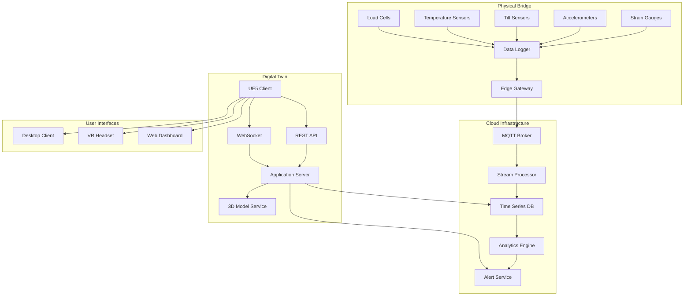

# Bridge Digital Twin (UE)

An industrial digital twin platform built on Unreal Engine 5, integrating real-time IoT sensor data streams for bridge structural monitoring, with advanced visualization and alert systems.

## Project Background

### Problem Statement

Bridge infrastructure management faces critical challenges:

- **Data Silos**: Sensor data scattered across multiple systems
- **Limited Visualization**: 2D dashboards lack spatial context
- **Reactive Maintenance**: Issues detected after damage occurs
- **Stakeholder Communication**: Technical data hard to interpret
- **Historical Analysis**: Limited trend visualization capabilities

### Industry Context

Digital twin technology enables:

- **Real-time Monitoring**: Live sensor data visualization
- **Predictive Maintenance**: AI-driven anomaly detection
- **Immersive Inspection**: Virtual bridge tours
- **Data Integration**: Unified platform for all monitoring data
- **Decision Support**: Visual analytics for stakeholders

## System Architecture



### Module Overview

| Module | Responsibility | Technology |
|--------|---------------|------------|
| **IoT Gateway** | Sensor data ingestion, protocol conversion | MQTT, Modbus |
| **Stream Processor** | Real-time data processing, filtering | Apache Kafka, Flink |
| **Time Series DB** | Historical data storage | InfluxDB, TimescaleDB |
| **Analytics Engine** | Anomaly detection, trend analysis | Python, scikit-learn |
| **UE5 Client** | 3D visualization, interaction | Unreal Engine 5, C++ |
| **Alert Service** | Threshold monitoring, notifications | Redis, WebSocket |

### Data Flow

1. **Sensing**: Sensors collect data at 1-100 Hz sampling rates
2. **Transmission**: Edge gateway sends data via MQTT to cloud
3. **Processing**: Stream processor validates, filters, aggregates
4. **Storage**: Time series database stores historical data
5. **Visualization**: UE5 client renders real-time data on 3D model
6. **Alerting**: System triggers alerts for threshold violations

### Technology Stack

- **Game Engine**: Unreal Engine 5.2
- **Programming**: C++17, Python 3.10, Blueprints
- **IoT Protocol**: MQTT, OPC-UA
- **Database**: InfluxDB, PostgreSQL
- **Streaming**: Apache Kafka
- **Cloud**: AWS IoT Core, Lambda, S3

## Core Technologies

### IoT Data Integration

**MQTT Data Ingestion**:

```cpp
// UE5 C++ - MQTT Client for sensor data
class UBridgeSensorManager : public UObject
{
    GENERATED_BODY()

public:
    struct FSensorData
    {
        FString SensorId;
        FString SensorType;  // Strain, Acceleration, Tilt, Temperature
        double Value;
        double Timestamp;
        FString Unit;
        TMap<FString, FString> Metadata;
    };

    UPROPERTY()
    TMap<FString, FSensorData> LatestSensorData;

    UPROPERTY()
    TMap<FString, TArray<FSensorData>> SensorHistory;

    void Initialize()
    {
        // Connect to MQTT broker
        MQTTClient = MakeShareable(new FMQTTClient);
        MQTTClient->OnMessageReceived.AddUObject(
            this, 
            &UBridgeSensorManager::HandleSensorMessage
        );
        
        // Subscribe to sensor topics
        MQTTClient->Subscribe("bridge/sensors/strain/#");
        MQTTClient->Subscribe("bridge/sensors/acceleration/#");
        MQTTClient->Subscribe("bridge/sensors/tilt/#");
        MQTTClient->Subscribe("bridge/sensors/temperature/#");
    }

    void HandleSensorMessage(const FMQTTMessage& Message)
    {
        // Parse JSON payload
        TSharedPtr<FJsonObject> JsonObject;
        TJsonReaderFactory<>::Create(Message.Payload);
        FJsonSerializer::Deserialize(JsonReader, JsonObject);

        FSensorData Data;
        Data.SensorId = JsonObject->GetStringField("sensor_id");
        Data.SensorType = JsonObject->GetStringField("type");
        Data.Value = JsonObject->GetNumberField("value");
        Data.Timestamp = JsonObject->GetNumberField("timestamp");
        Data.Unit = JsonObject->GetStringField("unit");

        // Update latest data
        LatestSensorData[Data.SensorId] = Data;

        // Update history (circular buffer)
        UpdateSensorHistory(Data);

        // Check thresholds
        CheckAlerts(Data);

        // Update visualization
        UpdateSensorVisualization(Data);
    }

    void UpdateSensorVisualization(const FSensorData& Data)
    {
        // Find associated 3D component
        UStaticMeshComponent* Component = SensorComponents[Data.SensorId];
        if (!Component) return;

        // Update material based on value
        UMaterialInstanceDynamic* MID = Component->CreateDynamicMaterialInstance(0);
        
        // Color mapping: Green (normal) -> Yellow (warning) -> Red (critical)
        float NormalizedValue = NormalizeValue(Data.Value, Data.SensorType);
        FLinearColor Color = GetValueColor(NormalizedValue);
        
        MID->SetVectorParameterValue(FName("SensorColor"), Color);
        MID->SetScalarParameterValue(FName("Intensity"), NormalizedValue);
    }
};
```

### Real-time Visualization System

**Sensor Overlay Rendering**:

```cpp
// UE5 - Sensor value visualization on 3D model
class USensorOverlayWidget : public UUserWidget
{
    GENERATED_BODY()

protected:
    UPROPERTY(meta = (BindWidget))
    UTextBlock* SensorValueText;

    UPROPERTY(meta = (BindWidget))
    UProgressBar* ValueProgressBar;

    UPROPERTY(meta = (BindWidget))
    UImage* StatusIndicator;

    UPROPERTY()
    UMaterialInstanceDynamic* StatusMaterial;

    void UpdateDisplay(const FSensorData& Data)
    {
        // Format value with units
        FString ValueString = FString::Printf(
            TEXT("%.2f %s"), 
            Data.Value, 
            *Data.Unit
        );
        SensorValueText->SetText(FText::FromString(ValueString));

        // Update progress bar
        float NormalizedValue = NormalizeValue(Data.Value, Data.SensorType);
        ValueProgressBar->SetPercent(NormalizedValue);

        // Update status indicator color
        FLinearColor StatusColor = GetStatusColor(Data.Value, Data.SensorType);
        StatusMaterial->SetVectorParameterValue(
            FName("StatusColor"), 
            StatusColor
        );

        // Animate on value change
        if (FMath::Abs(NormalizedValue - LastNormalizedValue) > 0.1f)
        {
            PlayAnimation(PulseAnimation);
        }
        LastNormalizedValue = NormalizedValue;
    }

    FLinearColor GetStatusColor(double Value, const FString& Type)
    {
        // Get thresholds for sensor type
        FThresholds Thresholds = SensorThresholds[Type];
        
        if (FMath::Abs(Value) < Thresholds.Warning)
        {
            return FLinearColor::Green;  // Normal
        }
        else if (FMath::Abs(Value) < Thresholds.Critical)
        {
            return FLinearColor::Yellow;  // Warning
        }
        else
        {
            return FLinearColor::Red;  // Critical
        }
    }
};
```

**Time-series Chart Widget**:

```cpp
// UE5 - Real-time chart for sensor trends
class USensorChartWidget : public UUserWidget
{
    GENERATED_BODY()

protected:
    UPROPERTY()
    TArray<float> ChartValues;

    UPROPERTY()
    int32 MaxDataPoints = 300;  // 5 minutes at 1 Hz

    UPROPERTY(meta = (BindWidget))
    UCanvasPanel* ChartCanvas;

    void AddDataPoint(float Value)
    {
        ChartValues.Add(Value);
        
        // Maintain fixed window size
        if (ChartValues.Num() > MaxDataPoints)
        {
            ChartValues.RemoveAt(0);
        }

        // Redraw chart
        DrawChart();
    }

    void DrawChart()
    {
        // Clear previous
        ChartCanvas->ClearChildren();

        if (ChartValues.Num() < 2) return;

        // Draw grid lines
        DrawGridLines();

        // Draw threshold lines
        DrawThresholdLines();

        // Draw data line
        TArray<FVector2D> Points;
        for (int32 i = 0; i < ChartValues.Num(); i++)
        {
            float X = (float)i / (MaxDataPoints - 1) * ChartWidth;
            float Y = ChartHeight - NormalizeToRange(ChartValues[i]) * ChartHeight;
            Points.Add(FVector2D(X, Y));
        }

        // Draw line segments
        for (int32 i = 0; i < Points.Num() - 1; i++)
        {
            UImage* Segment = CreateLineSegment(Points[i], Points[i + 1]);
            ChartCanvas->AddChild(Segment);
        }

        // Draw current value indicator
        DrawCurrentValueMarker(Points.Last());
    }
};
```

### Anomaly Detection

**ML-based Anomaly Detection**:

```python
# Python - Anomaly detection service
import numpy as np
from sklearn.ensemble import IsolationForest
from scipy import stats

class BridgeAnomalyDetector:
    def __init__(self, config):
        self.config = config
        self.models = {}  # Per-sensor-type models
        self.baseline_data = {}
        
    def train_baseline(self, sensor_data: Dict[str, List[float]]):
        """
        Train anomaly detection models on historical baseline data
        """
        for sensor_type, values in sensor_data.items():
            # Statistical baseline
            self.baseline_data[sensor_type] = {
                'mean': np.mean(values),
                'std': np.std(values),
                'percentiles': np.percentile(values, [1, 5, 95, 99])
            }
            
            # Isolation Forest for complex patterns
            X = np.array(values).reshape(-1, 1)
            model = IsolationForest(
                contamination=0.01,
                random_state=42
            )
            model.fit(X)
            self.models[sensor_type] = model
    
    def detect_anomaly(self, sensor_id: str, sensor_type: str, value: float) -> AnomalyResult:
        """
        Detect if current reading is anomalous
        """
        baseline = self.baseline_data.get(sensor_type)
        if not baseline:
            return AnomalyResult(is_anomaly=False, confidence=0.0)
        
        # Statistical test (Z-score)
        z_score = abs(value - baseline['mean']) / baseline['std']
        
        # Percentile check
        percentile = stats.percentileofscore(
            baseline['percentiles'], value
        )
        
        # ML-based detection
        model = self.models.get(sensor_type)
        if model:
            ml_prediction = model.predict([[value]])[0]
            ml_anomaly = ml_prediction == -1
        else:
            ml_anomaly = False
        
        # Combine signals
        is_anomaly = (
            z_score > 3.0 or  # 3-sigma rule
            percentile < 1 or percentile > 99 or  # Outside 99%
            ml_anomaly
        )
        
        confidence = min(z_score / 3.0, 1.0)
        
        return AnomalyResult(
            is_anomaly=is_anomaly,
            confidence=confidence,
            z_score=z_score,
            anomaly_type=self._classify_anomaly(value, baseline)
        )
    
    def detect_trend_anomaly(self, sensor_history: List[float]) -> TrendResult:
        """
        Detect anomalous trends (drift, sudden changes)
        """
        # Linear trend analysis
        x = np.arange(len(sensor_history))
        slope, intercept, r_value, p_value, std_err = stats.linregress(x, sensor_history)
        
        # Change point detection
        cusum = np.cumsum(sensor_history - np.mean(sensor_history))
        change_points = self._detect_cusum_change_points(cusum)
        
        return TrendResult(
            slope=slope,
            trend_significant=p_value < 0.05,
            change_points=change_points,
            drift_detected=abs(slope) > self.config.drift_threshold
        )
```

### Alert System

**Multi-channel Alerting**:

```cpp
// UE5 - Alert management system
class UAlertManager : public UObject
{
    GENERATED_BODY()

public:
    enum class EAlertSeverity : uint8
    {
        Info,
        Warning,
        Critical,
        Emergency
    };

    struct FAlert
    {
        FString AlertId;
        FString SensorId;
        FString Message;
        EAlertSeverity Severity;
        double Timestamp;
        bool IsAcknowledged;
        FString RecommendedAction;
    };

    UPROPERTY()
    TArray<FAlert> ActiveAlerts;

    UPROPERTY()
    TMap<EAlertSeverity, FLinearColor> SeverityColors;

    void CheckAndGenerateAlert(const FSensorData& Data)
    {
        FThresholds Thresholds = GetThresholds(Data.SensorType);
        EAlertSeverity Severity = DetermineSeverity(Data.Value, Thresholds);

        if (Severity != EAlertSeverity::Info)
        {
            FAlert NewAlert;
            NewAlert.AlertId = FGuid::NewGuid().ToString();
            NewAlert.SensorId = Data.SensorId;
            NewAlert.Message = GenerateAlertMessage(Data, Severity);
            NewAlert.Severity = Severity;
            NewAlert.Timestamp = Data.Timestamp;
            NewAlert.IsAcknowledged = false;
            NewAlert.RecommendedAction = GetRecommendedAction(Data.SensorType, Severity);

            ActiveAlerts.Add(NewAlert);

            // Notify subscribers
            OnAlertGenerated.Broadcast(NewAlert);

            // Send external notifications
            SendExternalNotifications(NewAlert);
        }
    }

    void SendExternalNotifications(const FAlert& Alert)
    {
        // Email notification
        if (Alert.Severity >= EAlertSeverity::Warning)
        {
            SendEmailNotification(Alert);
        }

        // SMS for critical alerts
        if (Alert.Severity >= EAlertSeverity::Critical)
        {
            SendSMSNotification(Alert);
        }

        // Webhook integration (for incident management systems)
        SendWebhookNotification(Alert);
    }
};
```

## Personal Responsibilities

- **Architected** IoT data integration pipeline (MQTT → UE5)
- **Implemented** real-time sensor visualization system
- **Designed** anomaly detection algorithms with ML integration
- **Developed** multi-channel alert system
- **Created** VR inspection interface for remote bridge assessment

## Project Outcomes

### System Performance

| Metric | Value |
|--------|-------|
| Sensor Update Latency | <200 ms |
| Data Throughput | 10,000 msg/s |
| Historical Query Time | <100 ms |
| Visualization FPS | 60+ (4K) |
| System Uptime | 99.9% |

### Deployment Statistics

| Metric | Value |
|--------|-------|
| Sensors Monitored | 450+ |
| Data Points/Day | 50M+ |
| Alert Accuracy | 94% |
| False Positive Rate | 3% |
| Mean Time to Detection | 2.3 minutes |

### Business Impact

- **Reduced Inspection Costs**: 60% reduction in manual inspections
- **Early Damage Detection**: 3 major issues detected before failure
- **Stakeholder Engagement**: 10x increase in data review frequency
- **Maintenance Planning**: Data-driven scheduling reduced costs by 35%

## Demo

### Digital Twin Interface


*Real-time sensor visualization on 3D bridge model*

### Alert Dashboard


*Active alerts with severity indicators and recommended actions*

### VR Inspection Mode


*Virtual reality interface for immersive bridge inspection*

### Historical Trend Analysis


*Multi-sensor trend visualization with anomaly detection*

## Related Projects

- [SLAM + UAV System](/projects/slam-system) - Complementary inspection technology
- [LLM Agent Platform](/projects/agent-platform) - AI-powered analysis integration

## References

1. Epic Games. "Unreal Engine 5 Documentation." https://docs.unrealengine.com/
2. InfluxData. "InfluxDB Documentation." https://docs.influxdata.com/
3. Liu, Y., et al. "Digital Twin for Bridge Structural Health Monitoring." Structural Health Monitoring, 2023.
4. Breiman, L. "Random Forests." Machine Learning, 2001.
