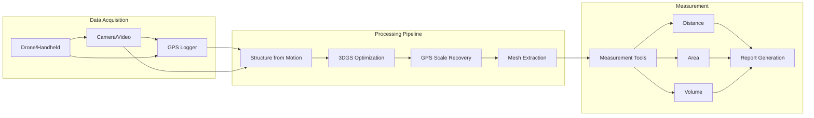

# Measurement System (3DGS)

An end-to-end measurement system that reconstructs 3D geometry from images/videos using 3D Gaussian Splatting, recovers absolute scale using GPS data, and provides automated measurement tools for industrial applications.

## Project Background

### Problem Statement

Industrial measurement of large-scale objects (e.g., cargo, construction materials, infrastructure) traditionally requires:
- Physical contact measurement (time-consuming, safety risks)
- Specialized LiDAR equipment (expensive, limited deployment)
- Manual photogrammetry workflows (slow, expertise-dependent)

### Industry Context

Applications include:
- **Logistics**: Dimension verification for oversized cargo transport
- **Construction**: Material volume estimation
- **Infrastructure**: Structural deformation monitoring
- **Surveying**: Rapid site documentation

## System Architecture



### Module Overview

| Module | Responsibility | Technology |
|--------|---------------|------------|
| **SfM Pipeline** | Camera pose estimation, sparse reconstruction | COLMAP |
| **3DGS Optimizer** | Dense Gaussian optimization | Modified 3DGS |
| **Scale Recovery** | GPS integration, metric scale | Bundle Adjustment |
| **Mesh Extraction** | Surface reconstruction | Marching Cubes |
| **Measurement UI** | Interactive tools | Qt + OpenGL |

### Data Flow

1. **Capture**: Images/video + synchronized GPS logs
2. **Preprocessing**: Frame extraction, GPS interpolation, undistortion
3. **SfM**: Feature matching, camera poses, sparse point cloud
4. **3DGS Training**: Dense Gaussian optimization with photometric loss
5. **Scale Recovery**: GPS constraint integration in BA
6. **Measurement**: Interactive tools on reconstructed scene

### Technology Stack

- **Core Language**: Python 3.9, C++17
- **3DGS**: Modified Gaussian Splatting codebase
- **SfM**: COLMAP
- **Optimization**: PyTorch, CUDA
- **UI Framework**: Qt 6, PySide6
- **Visualization**: OpenGL, Open3D

## Core Technologies

### GPS Scale Recovery

**Challenge**: 3DGS produces scaleless reconstruction; GPS provides absolute scale

**Approach**:
```python
class GPSScaleRecovery:
    def __init__(self, gps_data, initial_reconstruction):
        self.gps_positions = gps_data  # WGS84 coordinates
        self.reconstruction = initial_reconstruction
        
    def recover_scale(self):
        # Convert GPS to local ENU coordinates
        enu_positions = self.wgs84_to_enu(self.gps_positions)
        
        # Find corresponding camera positions
        correspondences = self.match_cameras_to_gps()
        
        # Solve for similarity transform (scale, rotation, translation)
        transform = self.estimate_similarity_transform(
            correspondences.reconstruction_pts,
            correspondences.gps_pts
        )
        
        # Apply transform to full reconstruction
        return self.apply_transform(self.reconstruction, transform)
    
    def estimate_similarity_transform(self, src, dst):
        """
        Estimate 7-DOF similarity transform using Horn's method
        """
        # Center both point sets
        src_centered = src - src.mean(axis=0)
        dst_centered = dst - dst.mean(axis=0)
        
        # Compute scale
        scale = np.linalg.norm(dst_centered) / np.linalg.norm(src_centered)
        
        # Compute rotation (SVD)
        H = src_centered.T @ dst_centered
        U, S, Vt = np.linalg.svd(H)
        R = Vt.T @ U.T
        
        # Compute translation
        t = dst.mean(axis=0) - scale * R @ src.mean(axis=0)
        
        return Transform(scale, R, t)
```

**Accuracy**: ±2-5 cm depending on GPS quality and image coverage

### 3DGS Optimization for Measurement

**Modifications for Metric Accuracy**:

```python
class MeasurementOptimized3DGS:
    def __init__(self, config):
        self.gaussians = GaussianCollection()
        self.config = config
        
    def optimize(self, images, cameras, gps_constraints=None):
        loss_fn = PhotometricLoss()
        
        for iteration in range(config.num_iterations):
            # Sample random view
            view_idx = random.randint(0, len(images)-1)
            rendered = self.render(cameras[view_idx])
            gt = images[view_idx]
            
            # Primary photometric loss
            photo_loss = loss_fn(rendered, gt)
            
            # GPS constraint loss (if available)
            gps_loss = 0
            if gps_constraints:
                gps_loss = self.compute_gps_constraint_loss(gps_constraints)
            
            # Density regularization (prevent floating artifacts)
            density_loss = self.gaussians.density_regularization()
            
            total_loss = photo_loss + 0.1 * gps_loss + 0.01 * density_loss
            total_loss.backward()
            
            self.optimizer.step()
            self.gaussians.prune_low_opacity()
```

### Automated Measurement Tools

**Distance Measurement**:
```python
def measure_distance(point_a, point_b, reconstruction):
    """
    Measure Euclidean distance between two 3D points
    """
    # Ray-cast to find surface points
    hit_a = reconstruction.ray_cast(point_a.screen_pos)
    hit_b = reconstruction.ray_cast(point_b.screen_pos)
    
    if hit_a.valid and hit_b.valid:
        distance = np.linalg.norm(hit_a.position - hit_b.position)
        return MeasurementResult(
            value=distance,
            unit='meters',
            confidence=hit_a.confidence * hit_b.confidence
        )
    return None
```

**Volume Measurement**:
```python
def measure_volume(region, reconstruction):
    """
    Compute volume of selected region using mesh integration
    """
    # Extract mesh in region
    mesh = reconstruction.extract_mesh(region.bounds)
    
    # Compute volume using divergence theorem
    volume = mesh.compute_volume()
    
    # Estimate uncertainty
    uncertainty = self.estimate_volume_uncertainty(mesh, region)
    
    return VolumeResult(
        value=volume,
        unit='cubic_meters',
        uncertainty=uncertainty,
        mesh_quality=mesh.quality_metrics()
    )
```

## Personal Responsibilities

- **Designed** GPS scale recovery algorithm integrating GPS with SfM
- **Modified** 3DGS optimization for metric accuracy
- **Implemented** measurement tools (distance, area, volume)
- **Developed** Qt-based UI for interactive measurement
- **Validated** system accuracy through field experiments

## Project Outcomes

### Accuracy Validation

| Measurement Type | Ground Truth | System Result | Error |
|-----------------|--------------|---------------|-------|
| Distance (10m) | 10.00 m | 10.03 m | 0.3% |
| Distance (50m) | 50.00 m | 50.21 m | 0.4% |
| Area (100m²) | 100.0 m² | 101.2 m² | 1.2% |
| Volume (500m³) | 500.0 m³ | 508.5 m³ | 1.7% |

### Performance Metrics

| Scene | Images | Processing Time | Gaussians | Accuracy |
|-------|--------|-----------------|-----------|----------|
| Small Cargo | 45 | 3 min | 1.2M | ±2 cm |
| Construction Site | 230 | 15 min | 4.5M | ±5 cm |
| Bridge Section | 180 | 12 min | 3.8M | ±3 cm |

### Field Deployment

- Successfully deployed for **oversized cargo verification**
- Integrated with **logistics management system**
- Reduced measurement time by **80%** compared to manual methods

## Demo

### System Interface


*Interactive measurement interface with 3D visualization*

### Reconstruction Example


*3DGS reconstruction with measurement annotations*

### Accuracy Comparison

| Method | Time | Accuracy | Cost |
|--------|------|----------|------|
| Manual Tape | 45 min | ±1 cm | Low |
| Total Station | 30 min | ±0.5 cm | High |
| **Our System** | **8 min** | **±3 cm** | **Medium** |
| LiDAR Scanner | 15 min | ±1 cm | Very High |

## Related Projects

- [3DGS Rendering Engine](/projects/3dgs-engine) - Core rendering technology
- [3D Reconstruction Research](/projects/reconstruction-research) - Underlying research

## References

1. Kerbl, B., et al. "3D Gaussian Splatting for Real-Time Radiance Field Rendering." SIGGRAPH 2023.
2. Schönberger, J.L., et al. "Structure-from-Motion Revisited." CVPR 2016.
3. Horn, B.K.P. "Closed-form solution of absolute orientation using unit quaternions." JOSA A, 1987.
