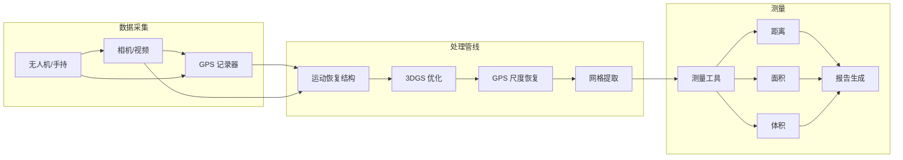
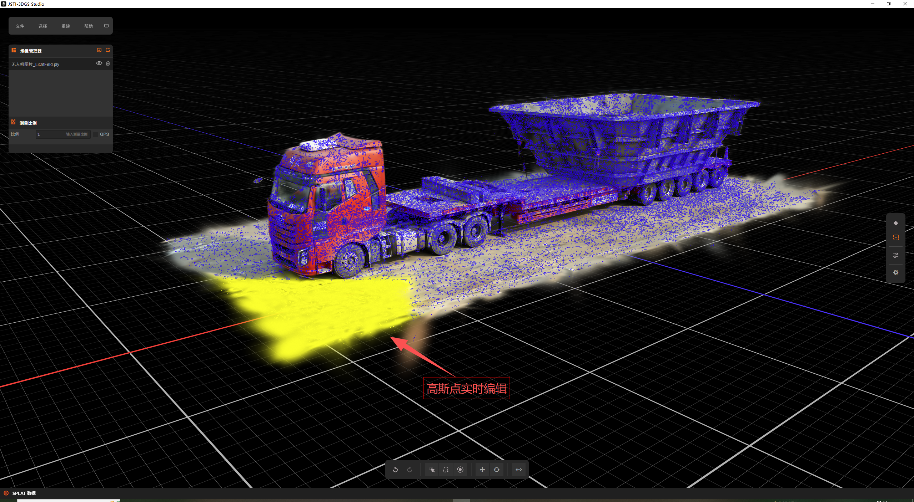
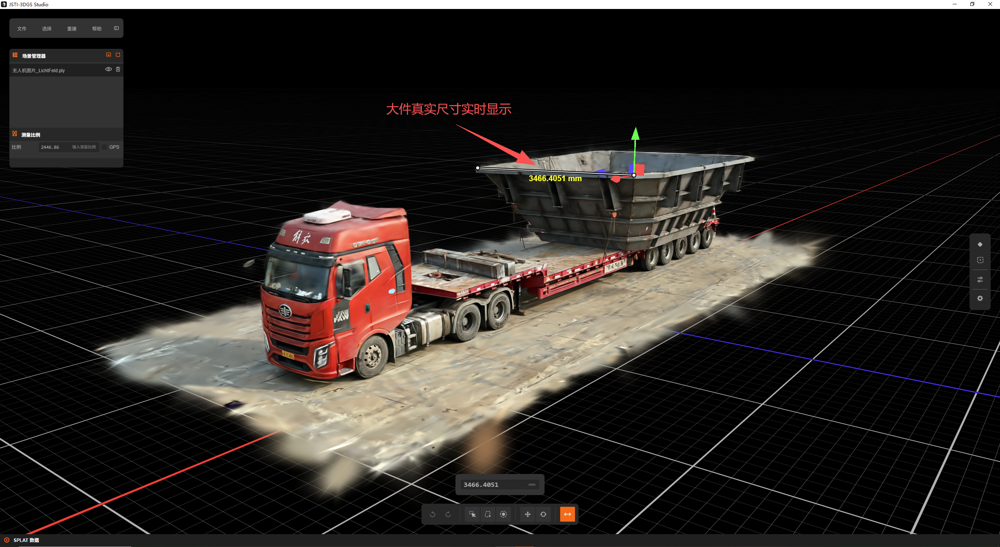

# 测量系统 (3DGS)

端到端测量系统，使用 3D 高斯泼溅从图像/视频重建 3D 几何，利用 GPS 数据恢复绝对尺度，为工业应用提供自动测量工具。

## 项目背景

### 问题陈述

大尺寸物体（如货物、建筑材料、基础设施）的工业测量传统上需要：
- 物理接触测量（耗时、安全风险）
- 专用 LiDAR 设备（昂贵、部署受限）
- 手动摄影测量工作流程（缓慢、依赖专业知识）

### 行业背景

应用包括：
- **物流**: 超大货物尺寸验证
- **建筑**: 材料体积估算
- **基础设施**: 结构变形监测
- **测量**: 快速场地记录

## 系统架构



### 模块概述

| 模块 | 职责 | 技术 |
|------|------|------|
| **SfM 管线** | 相机位姿估计、稀疏重建 | COLMAP |
| **3DGS 优化器** | 稠密高斯优化 | 修改版 3DGS |
| **尺度恢复** | GPS 集成、度量尺度 | 光束平差 |
| **网格提取** | 表面重建 | 移动立方体 |
| **测量 UI** | 交互工具 | Qt + OpenGL |

### 数据流

1. **采集**: 图像/视频 + 同步 GPS 日志
2. **预处理**: 帧提取、GPS 插值、畸变校正
3. **SfM**: 特征匹配、相机位姿、稀疏点云
4. **3DGS 训练**: 带有光度损失的稠密高斯优化
5. **尺度恢复**: GPS 约束集成到 BA
6. **测量**: 重建场景上的交互工具

### 技术栈

- **核心语言**: Python 3.9, C++17
- **3DGS**: 修改版高斯泼溅代码库
- **SfM**: COLMAP
- **优化**: PyTorch, CUDA
- **UI 框架**: Qt 6, PySide6
- **可视化**: OpenGL, Open3D

## 核心技术

### GPS 尺度恢复

**挑战**: 3DGS 产生无尺度重建；GPS 提供绝对尺度

**方法**:
```python
class GPSScaleRecovery:
    def __init__(self, gps_data, initial_reconstruction):
        self.gps_positions = gps_data  # WGS84 坐标
        self.reconstruction = initial_reconstruction
        
    def recover_scale(self):
        # 将 GPS 转换为局部 ENU 坐标
        enu_positions = self.wgs84_to_enu(self.gps_positions)
        
        # 查找对应相机位置
        correspondences = self.match_cameras_to_gps()
        
        # 求解相似变换（尺度、旋转、平移）
        transform = self.estimate_similarity_transform(
            correspondences.reconstruction_pts,
            correspondences.gps_pts
        )
        
        # 应用变换到完整重建
        return self.apply_transform(self.reconstruction, transform)
    
    def estimate_similarity_transform(self, src, dst):
        """
        使用 Horn 方法估计 7-DOF 相似变换
        """
        # 中心化两个点集
        src_centered = src - src.mean(axis=0)
        dst_centered = dst - dst.mean(axis=0)
        
        # 计算尺度
        scale = np.linalg.norm(dst_centered) / np.linalg.norm(src_centered)
        
        # 计算旋转（SVD）
        H = src_centered.T @ dst_centered
        U, S, Vt = np.linalg.svd(H)
        R = Vt.T @ U.T
        
        # 计算平移
        t = dst.mean(axis=0) - scale * R @ src.mean(axis=0)
        
        return Transform(scale, R, t)
```

**精度**: ±2-5 厘米，取决于 GPS 质量和图像覆盖

### 用于测量的 3DGS 优化

**度量精度修改**:

```python
class MeasurementOptimized3DGS:
    def __init__(self, config):
        self.gaussians = GaussianCollection()
        self.config = config
        
    def optimize(self, images, cameras, gps_constraints=None):
        loss_fn = PhotometricLoss()
        
        for iteration in range(config.num_iterations):
            # 采样随机视图
            view_idx = random.randint(0, len(images)-1)
            rendered = self.render(cameras[view_idx])
            gt = images[view_idx]
            
            # 主要光度损失
            photo_loss = loss_fn(rendered, gt)
            
            # GPS 约束损失（如果可用）
            gps_loss = 0
            if gps_constraints:
                gps_loss = self.compute_gps_constraint_loss(gps_constraints)
            
            # 密度正则化（防止漂浮伪影）
            density_loss = self.gaussians.density_regularization()
            
            total_loss = photo_loss + 0.1 * gps_loss + 0.01 * density_loss
            total_loss.backward()
            
            self.optimizer.step()
            self.gaussians.prune_low_opacity()
```

### 自动测量工具

**距离测量**:
```python
def measure_distance(point_a, point_b, reconstruction):
    """
    测量两个 3D 点之间的欧几里得距离
    """
    # 光线投射查找表面点
    hit_a = reconstruction.ray_cast(point_a.screen_pos)
    hit_b = reconstruction.ray_cast(point_b.screen_pos)
    
    if hit_a.valid and hit_b.valid:
        distance = np.linalg.norm(hit_a.position - hit_b.position)
        return MeasurementResult(
            value=distance,
            unit='米',
            confidence=hit_a.confidence * hit_b.confidence
        )
    return None
```

**体积测量**:
```python
def measure_volume(region, reconstruction):
    """
    使用网格积分计算选定区域的体积
    """
    # 提取区域网格
    mesh = reconstruction.extract_mesh(region.bounds)
    
    # 使用散度定理计算体积
    volume = mesh.compute_volume()
    
    # 估计不确定性
    uncertainty = self.estimate_volume_uncertainty(mesh, region)
    
    return VolumeResult(
        value=volume,
        unit='立方米',
        uncertainty=uncertainty,
        mesh_quality=mesh.quality_metrics()
    )
```

## 个人职责

- **设计** GPS 尺度恢复算法，将 GPS 与 SfM 集成
- **修改** 3DGS 优化以实现度量精度
- **实现** 测量工具（距离、面积、体积）
- **开发** 基于 Qt 的 UI 用于交互测量
- **验证** 通过现场实验验证系统精度

## 项目成果

### 精度验证

| 测量类型 | 真实值 | 系统结果 | 误差 |
|---------|--------|----------|------|
| 距离 (10m) | 10.00 m | 10.03 m | 0.3% |
| 距离 (50m) | 50.00 m | 50.21 m | 0.4% |
| 面积 (100m²) | 100.0 m² | 101.2 m² | 1.2% |
| 体积 (500m³) | 500.0 m³ | 508.5 m³ | 1.7% |

### 性能指标

| 场景 | 图像数 | 处理时间 | 高斯数 | 精度 |
|------|--------|----------|--------|------|
| 小型货物 | 45 | 3 分钟 | 120 万 | ±2 cm |
| 建筑工地 | 230 | 15 分钟 | 450 万 | ±5 cm |
| 桥梁段 | 180 | 12 分钟 | 380 万 | ±3 cm |

### 现场部署

- 成功部署用于**超大货物验证**
- 集成到**物流管理系统**
- 相比手动方法测量时间减少**80%**

## 演示

### 系统界面


*带有 3D 可视化的交互测量界面*

### 重建示例


*带有测量标注的 3DGS 重建*

### 精度对比

| 方法 | 时间 | 精度 | 成本 |
|------|------|------|------|
| 手动卷尺 | 45 分钟 | ±1 cm | 低 |
| 全站仪 | 30 分钟 | ±0.5 cm | 高 |
| **本系统** | **8 分钟** | **±3 cm** | **中** |
| LiDAR 扫描仪 | 15 分钟 | ±1 cm | 很高 |

## 画廊

<div class="gallery-grid">

<div class="gallery-item">
  <div class="gallery-image-wrapper">
    
  </div>
  <div class="gallery-info">
    <h4>测量界面</h4>
    <p>交互式尺寸测量</p>
  </div>
</div>

<div class="gallery-item">
  <div class="gallery-image-wrapper">
    
  </div>
  <div class="gallery-info">
    <h4>3D 重建</h4>
    <p>从图像重建 3D 几何</p>
  </div>
</div>

<div class="gallery-item">
  <div class="gallery-image-wrapper">
    
  </div>
  <div class="gallery-info">
    <h4>主工作流视图</h4>
    <p>从数据导入到结果导出的完整测量流程</p>
  </div>
</div>

<div class="gallery-item">
  <div class="gallery-image-wrapper">
    
  </div>
  <div class="gallery-info">
    <h4>点云编辑工具</h4>
    <p>对重建点云进行裁剪、分段与清理</p>
  </div>
</div>

<div class="gallery-item">
  <div class="gallery-image-wrapper">
    
  </div>
  <div class="gallery-info">
    <h4>测量案例一</h4>
    <p>大件货物尺寸自动测量示例</p>
  </div>
</div>

<div class="gallery-item">
  <div class="gallery-image-wrapper">
    
  </div>
  <div class="gallery-info">
    <h4>测量案例二</h4>
    <p>复杂场景下的体积与面积测量</p>
  </div>
</div>

</div>

## 相关项目

- [3DGS 渲染引擎](/projects/3dgs-engine) - 核心渲染技术
- [三维重建研究](/projects/reconstruction-research) - 基础研究

## 参考文献

1. Kerbl, B., et al. "3D Gaussian Splatting for Real-Time Radiance Field Rendering." SIGGRAPH 2023.
2. Schönberger, J.L., et al. "Structure-from-Motion Revisited." CVPR 2016.
3. Horn, B.K.P. "Closed-form solution of absolute orientation using unit quaternions." JOSA A, 1987.

<style>
.gallery-grid {
  display: grid;
  grid-template-columns: repeat(auto-fit, minmax(280px, 1fr));
  gap: 1.5rem;
  margin: 2rem 0;
}

.gallery-item {
  border-radius: 12px;
  overflow: hidden;
  background-color: var(--vp-c-bg-elv);
  border: 1px solid var(--vp-c-divider);
  transition: all 0.3s ease;
}

.gallery-item:hover {
  border-color: var(--vp-c-brand);
  box-shadow: 0 8px 24px rgba(0, 0, 0, 0.12);
  transform: translateY(-4px);
}

.gallery-image-wrapper {
  position: relative;
  width: 100%;
  padding-top: 56.25%;
  overflow: hidden;
  background-color: var(--vp-c-bg-alt);
}

.gallery-image {
  position: absolute;
  top: 0;
  left: 0;
  width: 100%;
  height: 100%;
  object-fit: cover;
  transition: transform 0.3s ease;
}

.gallery-item:hover .gallery-image {
  transform: scale(1.05);
}

.gallery-info {
  padding: 1.25rem;
}

.gallery-info h4 {
  margin: 0 0 0.5rem 0;
  font-size: 1.1rem;
  color: var(--vp-c-brand);
}

.gallery-info p {
  margin: 0;
  font-size: 0.9rem;
  color: var(--vp-c-text-2);
  line-height: 1.5;
}
</style>
