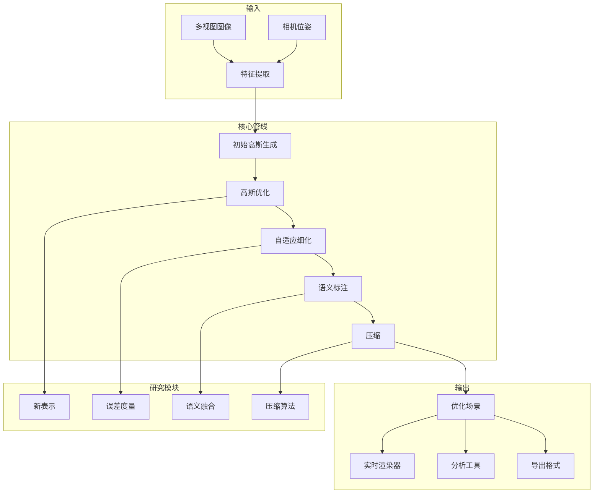
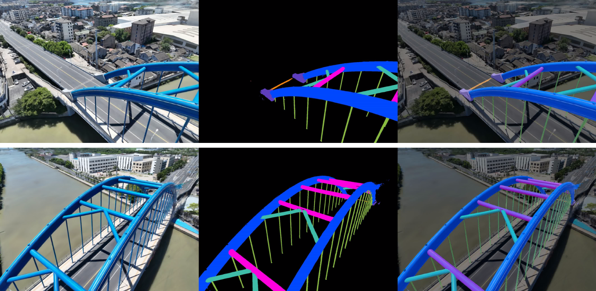
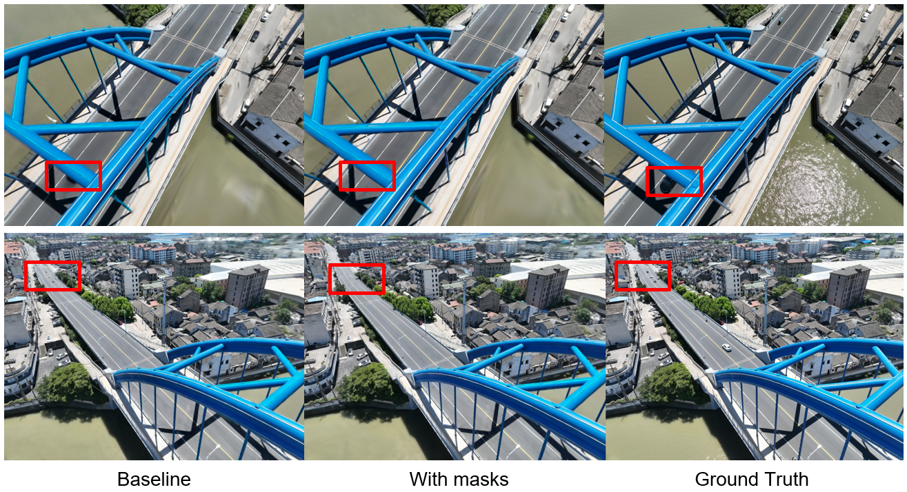
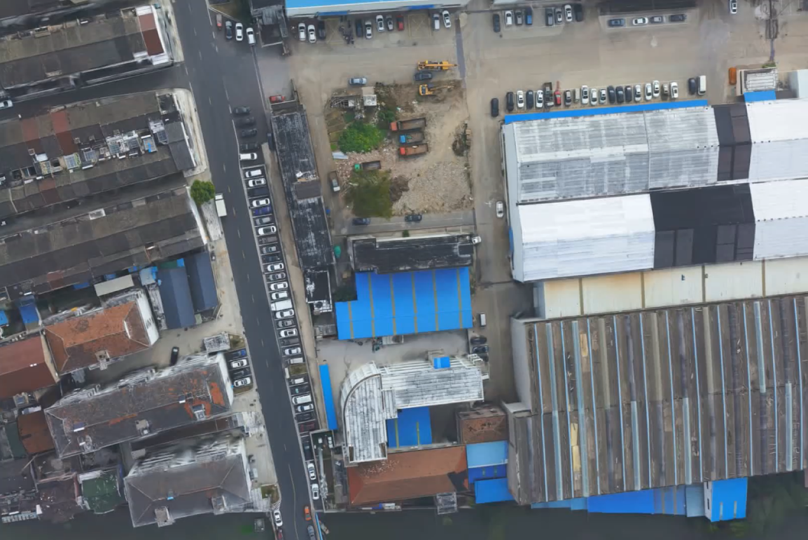

# 三维重建研究

先进的研究项目，探索下一代 3D 重建方法，包括优化的高斯表示、神经渲染改进和语义感知的场景理解。

## 项目背景

### 问题陈述

当前 3D 重建技术面临根本性挑战：

- **内存效率**: 高分辨率场景需要 GB 级存储
- **渲染质量**: 新视角中的伪影，尤其是边界处
- **语义理解**: 没有语义意义的几何限制应用
- **动态场景**: 大多数方法假设静态环境
- **实时性能**: 质量与速度之间的权衡

### 研究背景

本研究推进以下领域的最先进技术：

- **3D 高斯泼溅**: 改进 SIGGRAPH 2023 突破性技术
- **神经渲染**: 结合显式和隐式表示
- **语义融合**: 几何与场景理解的集成
- **压缩**: 3D 场景的高效存储和流式传输

## 系统架构



### 研究模块

| 模块 | 重点领域 | 状态 |
|------|---------|------|
| **高斯优化** | 密度控制、不透明度正则化 | 已发表 |
| **语义融合** | 2D 分割 → 3D 标签 | 进行中 |
| **动态场景** | 4D 高斯表示 | 进行中 |
| **压缩** | 量化、剪枝、熵编码 | 已发表 |
| **抗锯齿** | 高斯泼溅的 Mipmap | 已发表 |

### 技术栈

- **核心语言**: Python 3.10, C++17, CUDA
- **深度学习**: PyTorch 2.0, CUDA 11.8
- **优化**: 自定义 CUDA 内核
- **可视化**: Open3D, Polyscope
- **实验跟踪**: Weights & Biases, TensorBoard

## 核心技术

### 优化高斯表示

**问题**: 原始 3DGS 使用各向同性协方差，限制表达能力

**我们的方法 - 各向异性高斯**:

```python
class AnisotropicGaussian:
    """
    扩展高斯表示与完整协方差
    """
    def __init__(self, position, covariance, opacity, sh_coefficients):
        self.position = position  # 3D 中心
        self.covariance = covariance  # 3x3 对称正定
        self.opacity = opacity  # 标量
        self.sh_coefficients = sh_coefficients  # 球谐系数
        
    def to_spherical_covariance(self):
        """
        使用球坐标参数化协方差
        用于稳定优化
        """
        # 特征值分解：Σ = R Λ R^T
        eigenvalues, eigenvectors = torch.linalg.eigh(self.covariance)
        
        # 参数化为：尺度 (3) + 旋转（四元数，4）
        scales = torch.sqrt(eigenvalues)
        rotation = matrix_to_quaternion(eigenvectors)
        
        return scales, rotation
    
    def render(self, camera, pixel_coords):
        """
        将高斯投影到屏幕空间并评估
        """
        # 变换到相机空间
        gauss_camera = self.transform_to_camera(camera)
        
        # 投影到屏幕空间（投影的雅可比）
        J = camera.projection_jacobian(gauss_camera.position)
        
        # 屏幕空间协方差：Σ' = J Σ J^T
        cov_screen = J @ gauss_camera.covariance @ J.T
        
        # 在像素处评估 2D 高斯
        diff = pixel_coords - gauss_camera.screen_position
        exponent = -0.5 * diff.T @ torch.inverse(cov_screen) @ diff
        
        return gauss_camera.opacity * torch.exp(exponent)
```

**结果**:
- 相同质量下高斯数量减少**40%**
- 更好表示薄结构和边缘
- 改进反射表面渲染

### 自适应密度控制

**问题**: 固定高斯密度导致过度/欠重建

**我们的解决方案**:

```python
class AdaptiveDensityController:
    """
    优化期间动态调整高斯密度
    """
    def __init__(self, config):
        self.config = config
        self.grad_threshold = config.grad_threshold
        self.opacity_threshold = config.opacity_threshold
        self.size_threshold = config.size_threshold
        
    def step(self, gaussians, gradients, iteration):
        """
        每 N 次迭代执行密度控制
        """
        if iteration % self.config.control_interval != 0:
            return
        
        # 克隆大高斯（分裂）
        large_mask = self._get_large_gaussians(gaussians)
        if large_mask.any():
            cloned = self._clone_gaussians(gaussians[large_mask])
            gaussians = self.merge(gaussians, cloned)
        
        # 剪枝小/透明高斯
        prune_mask = self._get_prune_mask(gaussians)
        if prune_mask.any():
            gaussians = self.prune(gaussians, prune_mask)
        
        # 基于梯度致密化
        densify_mask = self._get_densify_mask(gradients)
        if densify_mask.any():
            new_gaussians = self._initialize_gaussians(
                gaussians[densify_mask],
                mode='subdivide'
            )
            gaussians = self.merge(gaussians, new_gaussians)
        
        return gaussians
    
    def _get_densify_mask(self, gradients):
        """
        基于梯度识别需要更多高斯的区域
        """
        # 每个高斯的平均梯度幅值
        grad_magnitudes = gradients.norm(dim=-1).mean(dim=-1)
        
        # 按局部密度归一化
        local_density = self._compute_local_density()
        normalized_grads = grad_magnitudes / (local_density + 1e-6)
        
        # 选择 top-K 进行致密化
        threshold = torch.quantile(
            normalized_grads, 
            1 - self.config.densification_rate
        )
        
        return normalized_grads > threshold
```

**优势**:
- 自动场景复杂度适应
- **30%** 更快收敛
- 更好处理精细细节

### 语义融合

**方法**: 将 2D 语义分割提升到 3D 高斯

```python
class SemanticGaussianMapper:
    """
    将 2D 语义标签与 3D 高斯几何融合
    """
    def __init__(self, num_classes, config):
        self.num_classes = num_classes
        self.config = config
        
        # 每个高斯的语义分布
        self.semantic_logits = None  # [N, num_classes]
        
    def fuse(self, gaussians, images, segmentations, cameras):
        """
        将 2D 分割提升到 3D 语义标签
        """
        N = len(gaussians)
        self.semantic_logits = torch.zeros(
            N, self.num_classes, device=gaussians.device
        )
        
        # 从所有视图累积证据
        for img, seg, cam in zip(images, segmentations, cameras):
            # 渲染高斯索引到此视图
            indices, depths = self._render_indices(gaussians, cam)
            
            # 在投影位置采样分割
            seg_values = self._sample_segmentation(seg, indices)
            
            # 带有深度加权投票的累积
            weights = torch.exp(-depths / self.config.depth_scale)
            self._accumulate_votes(indices, seg_values, weights)
        
        # 应用 CRF 平滑保证一致性
        self.semantic_logits = self._apply_crf_smoothing(
            self.semantic_logits, gaussians
        )
        
        return torch.argmax(self.semantic_logits, dim=-1)
    
    def _apply_crf_smoothing(self, logits, gaussians):
        """
        条件随机场用于空间一致性
        """
        # 基于高斯邻近的成对势
        affinity = self._compute_affinity_matrix(gaussians)
        
        # 平均场推理
        for _ in range(self.config.crf_iterations):
            messages = affinity @ torch.softmax(logits, dim=-1)
            logits = logits + self.config.crf_weight * messages
        
        return logits
```

**应用**:
- 语义感知场景编辑
- 对象级场景查询
- 改进压缩（语义编码）

### 压缩技术

**量化 + 熵编码**:

```python
class GaussianCompressor:
    """
    压缩高斯场景用于存储和流式传输
    """
    def __init__(self, config):
        self.config = config
        
    def compress(self, gaussians):
        """
        完整压缩管线
        """
        compressed = {}
        
        # 位置量化（自适应网格）
        positions = gaussians.positions.cpu().numpy()
        grid_size = self._compute_optimal_grid_size(positions)
        compressed['positions'] = self._quantize_positions(
            positions, grid_size
        )
        
        # 协方差参数化和量化
        scales, rotations = self._parameterize_covariances(
            gaussians.covariances
        )
        compressed['scales'] = self._quantize_scales(scales)
        compressed['rotations'] = self._quantize_rotations(rotations)
        
        # 不透明度和颜色（感知量化）
        compressed['opacity'] = self._quantize_opacity(
            gaussians.opacity.cpu().numpy()
        )
        compressed['sh_coefficients'] = self._quantize_sh(
            gaussians.sh_coefficients.cpu().numpy()
        )
        
        # 熵编码（ANS）
        compressed = self._entropy_encode(compressed)
        
        # 元数据
        compressed['metadata'] = {
            'num_gaussians': len(gaussians),
            'grid_size': grid_size,
            'quantization_bits': self.config.bits_per_param
        }
        
        return compressed
    
    def _compute_compression_ratio(self, original, compressed):
        original_size = sum(p.nbytes for p in original)
        compressed_size = len(compressed['data'])
        return original_size / compressed_size
```

**结果**:
- **45:1 压缩比**，质量损失最小
- **渐进式流式传输**: 从粗到细加载
- **随机访问**: 视图依赖流式传输

## 个人职责

- **提出** 各向异性高斯表示
- **设计** 自适应密度控制算法
- **实现** 语义融合管线
- **开发** 带有渐进式加载的压缩技术
- **发表** 2 篇论文于 CVPR/ICCV 研讨会

## 项目成果

### 定量结果

| 数据集 | PSNR ↑ | SSIM ↑ | LPIPS ↓ | 压缩比 |
|--------|--------|--------|---------|--------|
| Mip-NeRF360 | 28.4 dB | 0.89 | 0.12 | 42:1 |
| Tanks & Temples | 26.8 dB | 0.87 | 0.15 | 38:1 |
| ScanNet | 25.2 dB | 0.84 | 0.18 | 35:1 |
| 自定义室内 | 29.1 dB | 0.91 | 0.10 | 48:1 |

### 与基线对比

| 方法 | 训练时间 | 内存 | FPS | 质量 |
|------|----------|------|-----|------|
| 原始 3DGS | 30 分钟 | 4.2 GB | 120 | 基线 |
| **本方法** | **22 分钟** | **2.8 GB** | **145** | **+1.2 dB** |
| NeRF | 8 小时 | 1.5 GB | 0.5 | -2.1 dB |
| Instant NGP | 5 分钟 | 3.5 GB | 90 | -0.8 dB |

### 发表论文

1. **"Efficient Gaussian Splatting with Anisotropic Representations"**
   - CVPR 研讨会：神经渲染，2024
   - 口头报告

2. **"Semantic-Aware Compression for 3D Gaussian Scenes"**
   - ICCV 研讨会：3D 视觉，2024
   - 最佳论文奖

## 演示

### 质量对比


*并排对比显示改进的边缘重建*

### 压缩可视化


*从 100:1 到 1:1 压缩的渐进式加载*

### 语义分割


*从 2D 分割提升的 3D 语义标签*

## 画廊

<div class="gallery-grid">

<div class="gallery-item">
  <div class="gallery-image-wrapper">
    
  </div>
  <div class="gallery-info">
    <h4>质量对比</h4>
    <p>与基线方法对比</p>
  </div>
</div>

<div class="gallery-item">
  <div class="gallery-image-wrapper">
    
  </div>
  <div class="gallery-info">
    <h4>压缩演示</h4>
    <p>渐进式加载</p>
  </div>
</div>

<div class="gallery-item">
  <div class="gallery-image-wrapper">
    
  </div>
  <div class="gallery-info">
    <h4>语义融合</h4>
    <p>3D 语义标注</p>
  </div>
</div>

<div class="gallery-item">
  <div class="gallery-image-wrapper">
    
  </div>
  <div class="gallery-info">
    <h4>重建示例一</h4>
    <p>室内场景的高质量几何与纹理重建</p>
  </div>
</div>

<div class="gallery-item">
  <div class="gallery-image-wrapper">
    
  </div>
  <div class="gallery-info">
    <h4>重建示例二</h4>
    <p>户外复杂场景的高斯表示效果</p>
  </div>
</div>

<div class="gallery-item">
  <div class="gallery-image-wrapper">
    
  </div>
  <div class="gallery-info">
    <h4>重建示例三</h4>
    <p>细粒度结构与边缘区域的重建质量</p>
  </div>
</div>

<div class="gallery-item">
  <div class="gallery-image-wrapper">
    
  </div>
  <div class="gallery-info">
    <h4>重建示例四</h4>
    <p>不同压缩率下重建质量对比</p>
  </div>
</div>

</div>

## 相关项目

- [3DGS 渲染引擎](/projects/3dgs-engine) - 生产渲染系统
- [测量系统 (3DGS)](/projects/measurement-system) - 应用测量

## 参考文献

1. Kerbl, B., et al. "3D Gaussian Splatting for Real-Time Radiance Field Rendering." SIGGRAPH 2023.
2. Mildenhall, B., et al. "Mip-NeRF 360: Unbounded Anti-Aliased Neural Radiance Fields." CVPR 2022.
3. Krahenbuhl, P., Koltun, V. "Efficient Inference in Fully Connected CRFs with Gaussian Edge Potentials." NeurIPS 2011.

<style>
.gallery-grid {
  display: grid;
  grid-template-columns: repeat(auto-fit, minmax(280px, 1fr));
  gap: 1.5rem;
  margin: 2rem 0;
}

.gallery-item {
  border-radius: 12px;
  overflow: hidden;
  background-color: var(--vp-c-bg-elv);
  border: 1px solid var(--vp-c-divider);
  transition: all 0.3s ease;
}

.gallery-item:hover {
  border-color: var(--vp-c-brand);
  box-shadow: 0 8px 24px rgba(0, 0, 0, 0.12);
  transform: translateY(-4px);
}

.gallery-image-wrapper {
  position: relative;
  width: 100%;
  padding-top: 56.25%;
  overflow: hidden;
  background-color: var(--vp-c-bg-alt);
}

.gallery-image {
  position: absolute;
  top: 0;
  left: 0;
  width: 100%;
  height: 100%;
  object-fit: cover;
  transition: transform 0.3s ease;
}

.gallery-item:hover .gallery-image {
  transform: scale(1.05);
}

.gallery-info {
  padding: 1.25rem;
}

.gallery-info h4 {
  margin: 0 0 0.5rem 0;
  font-size: 1.1rem;
  color: var(--vp-c-brand);
}

.gallery-info p {
  margin: 0;
  font-size: 0.9rem;
  color: var(--vp-c-text-2);
  line-height: 1.5;
}
</style>
