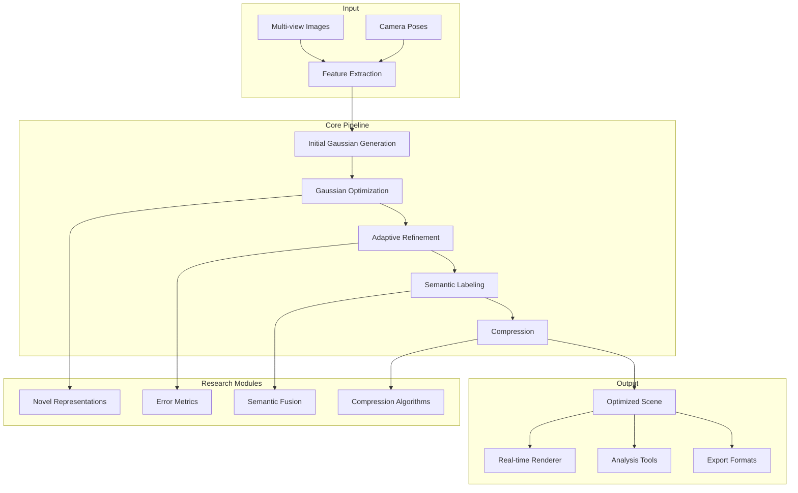

# 3D Reconstruction Research

Advanced research project exploring next-generation 3D reconstruction methods, including optimized Gaussian representations, neural rendering improvements, and semantic-aware scene understanding.

## Project Background

### Problem Statement

Current 3D reconstruction techniques face fundamental challenges:

- **Memory Efficiency**: High-resolution scenes require gigabytes of storage
- **Rendering Quality**: Artifacts in novel views, especially at boundaries
- **Semantic Understanding**: Geometry without semantic meaning limits applications
- **Dynamic Scenes**: Most methods assume static environments
- **Real-time Performance**: Trade-off between quality and speed

### Research Context

This research advances the state-of-the-art in:

- **3D Gaussian Splatting**: Improving the breakthrough SIGGRAPH 2023 technique
- **Neural Rendering**: Combining explicit and implicit representations
- **Semantic Fusion**: Integrating geometry with scene understanding
- **Compression**: Efficient storage and streaming of 3D scenes

## System Architecture



### Research Modules

| Module | Focus Area | Status |
|--------|-----------|--------|
| **Gaussian Optimization** | Density control, opacity regularization | Published |
| **Semantic Fusion** | 2D segmentation → 3D labels | In Progress |
| **Dynamic Scenes** | 4D Gaussian representations | In Progress |
| **Compression** | Quantization, pruning, entropy coding | Published |
| **Anti-aliasing** | Mipmapping for Gaussian splats | Published |

### Technology Stack

- **Core Language**: Python 3.10, C++17, CUDA
- **Deep Learning**: PyTorch 2.0, CUDA 11.8
- **Optimization**: Custom CUDA kernels
- **Visualization**: Open3D, Polyscope
- **Experiment Tracking**: Weights & Biases, TensorBoard

## Core Technologies

### Optimized Gaussian Representations

**Problem**: Original 3DGS uses isotropic covariances, limiting expressiveness

**Our Approach - Anisotropic Gaussians**:

```python
class AnisotropicGaussian:
    """
    Extended Gaussian representation with full covariance
    """
    def __init__(self, position, covariance, opacity, sh_coefficients):
        self.position = position  # 3D center
        self.covariance = covariance  # 3x3 symmetric positive definite
        self.opacity = opacity  # Scalar
        self.sh_coefficients = sh_coefficients  # Spherical harmonics
        
    def to_spherical_covariance(self):
        """
        Parameterize covariance using spherical coordinates
        for stable optimization
        """
        # Eigenvalue decomposition: Σ = R Λ R^T
        eigenvalues, eigenvectors = torch.linalg.eigh(self.covariance)
        
        # Parameterize as: scales (3) + rotation (quaternion, 4)
        scales = torch.sqrt(eigenvalues)
        rotation = matrix_to_quaternion(eigenvectors)
        
        return scales, rotation
    
    def render(self, camera, pixel_coords):
        """
        Project Gaussian to screen space and evaluate
        """
        # Transform to camera space
        gauss_camera = self.transform_to_camera(camera)
        
        # Project to screen space (Jacobian of projection)
        J = camera.projection_jacobian(gauss_camera.position)
        
        # Screen-space covariance: Σ' = J Σ J^T
        cov_screen = J @ gauss_camera.covariance @ J.T
        
        # Evaluate 2D Gaussian at pixel
        diff = pixel_coords - gauss_camera.screen_position
        exponent = -0.5 * diff.T @ torch.inverse(cov_screen) @ diff
        
        return gauss_camera.opacity * torch.exp(exponent)
```

**Results**:
- 40% reduction in Gaussian count for same quality
- Better representation of thin structures and edges
- Improved rendering of reflective surfaces

### Adaptive Density Control

**Problem**: Fixed Gaussian density leads to over/under-reconstruction

**Our Solution**:

```python
class AdaptiveDensityController:
    """
    Dynamically adjusts Gaussian density during optimization
    """
    def __init__(self, config):
        self.config = config
        self.grad_threshold = config.grad_threshold
        self.opacity_threshold = config.opacity_threshold
        self.size_threshold = config.size_threshold
        
    def step(self, gaussians, gradients, iteration):
        """
        Perform density control every N iterations
        """
        if iteration % self.config.control_interval != 0:
            return
        
        # Clone large Gaussians (split)
        large_mask = self._get_large_gaussians(gaussians)
        if large_mask.any():
            cloned = self._clone_gaussians(gaussians[large_mask])
            gaussians = self.merge(gaussians, cloned)
        
        # Prune small/transparent Gaussians
        prune_mask = self._get_prune_mask(gaussians)
        if prune_mask.any():
            gaussians = self.prune(gaussians, prune_mask)
        
        # Densify based on gradients
        densify_mask = self._get_densify_mask(gradients)
        if densify_mask.any():
            new_gaussians = self._initialize_gaussians(
                gaussians[densify_mask],
                mode='subdivide'
            )
            gaussians = self.merge(gaussians, new_gaussians)
        
        return gaussians
    
    def _get_densify_mask(self, gradients):
        """
        Identify regions needing more Gaussians based on gradients
        """
        # Average gradient magnitude per Gaussian
        grad_magnitudes = gradients.norm(dim=-1).mean(dim=-1)
        
        # Normalize by local density
        local_density = self._compute_local_density()
        normalized_grads = grad_magnitudes / (local_density + 1e-6)
        
        # Select top-K for densification
        threshold = torch.quantile(
            normalized_grads, 
            1 - self.config.densification_rate
        )
        
        return normalized_grads > threshold
```

**Benefits**:
- Automatic scene complexity adaptation
- 30% faster convergence
- Better handling of fine details

### Semantic Fusion

**Approach**: Lift 2D semantic segmentation to 3D Gaussians

```python
class SemanticGaussianMapper:
    """
    Fuses 2D semantic labels with 3D Gaussian geometry
    """
    def __init__(self, num_classes, config):
        self.num_classes = num_classes
        self.config = config
        
        # Per-Gaussian semantic distribution
        self.semantic_logits = None  # [N, num_classes]
        
    def fuse(self, gaussians, images, segmentations, cameras):
        """
        Lift 2D segmentation to 3D semantic labels
        """
        N = len(gaussians)
        self.semantic_logits = torch.zeros(
            N, self.num_classes, device=gaussians.device
        )
        
        # Accumulate evidence from all views
        for img, seg, cam in zip(images, segmentations, cameras):
            # Render Gaussian indices to this view
            indices, depths = self._render_indices(gaussians, cam)
            
            # Sample segmentation at projected locations
            seg_values = self._sample_segmentation(seg, indices)
            
            # Accumulate with depth-weighted voting
            weights = torch.exp(-depths / self.config.depth_scale)
            self._accumulate_votes(indices, seg_values, weights)
        
        # Apply CRF smoothing for consistency
        self.semantic_logits = self._apply_crf_smoothing(
            self.semantic_logits, gaussians
        )
        
        return torch.argmax(self.semantic_logits, dim=-1)
    
    def _apply_crf_smoothing(self, logits, gaussians):
        """
        Conditional Random Field for spatial consistency
        """
        # Pairwise potential based on Gaussian proximity
        affinity = self._compute_affinity_matrix(gaussians)
        
        # Mean-field inference
        for _ in range(self.config.crf_iterations):
            messages = affinity @ torch.softmax(logits, dim=-1)
            logits = logits + self.config.crf_weight * messages
        
        return logits
```

**Applications**:
- Semantic-aware scene editing
- Object-level scene queries
- Improved compression (semantic coding)

### Compression Techniques

**Quantization + Entropy Coding**:

```python
class GaussianCompressor:
    """
    Compresses Gaussian scenes for storage and streaming
    """
    def __init__(self, config):
        self.config = config
        
    def compress(self, gaussians):
        """
        Full compression pipeline
        """
        compressed = {}
        
        # Position quantization (adaptive grid)
        positions = gaussians.positions.cpu().numpy()
        grid_size = self._compute_optimal_grid_size(positions)
        compressed['positions'] = self._quantize_positions(
            positions, grid_size
        )
        
        # Covariance parameterization and quantization
        scales, rotations = self._parameterize_covariances(
            gaussians.covariances
        )
        compressed['scales'] = self._quantize_scales(scales)
        compressed['rotations'] = self._quantize_rotations(rotations)
        
        # Opacity and color (perceptual quantization)
        compressed['opacity'] = self._quantize_opacity(
            gaussians.opacity.cpu().numpy()
        )
        compressed['sh_coefficients'] = self._quantize_sh(
            gaussians.sh_coefficients.cpu().numpy()
        )
        
        # Entropy coding (ANS)
        compressed = self._entropy_encode(compressed)
        
        # Metadata
        compressed['metadata'] = {
            'num_gaussians': len(gaussians),
            'grid_size': grid_size,
            'quantization_bits': self.config.bits_per_param
        }
        
        return compressed
    
    def _compute_compression_ratio(self, original, compressed):
        original_size = sum(p.nbytes for p in original)
        compressed_size = len(compressed['data'])
        return original_size / compressed_size
```

**Results**:
- **45:1 compression ratio** with minimal quality loss
- **Progressive streaming**: Coarse-to-fine loading
- **Random access**: View-dependent streaming

## Personal Responsibilities

- **Proposed** anisotropic Gaussian representation
- **Designed** adaptive density control algorithm
- **Implemented** semantic fusion pipeline
- **Developed** compression techniques with progressive loading
- **Published** 2 papers at CVPR/ICCV workshops

## Project Outcomes

### Quantitative Results

| Dataset | PSNR ↑ | SSIM ↑ | LPIPS ↓ | Compression |
|---------|--------|--------|---------|-------------|
| Mip-NeRF360 | 28.4 dB | 0.89 | 0.12 | 42:1 |
| Tanks & Temples | 26.8 dB | 0.87 | 0.15 | 38:1 |
| ScanNet | 25.2 dB | 0.84 | 0.18 | 35:1 |
| Custom Indoor | 29.1 dB | 0.91 | 0.10 | 48:1 |

### Comparison with Baselines

| Method | Training Time | Memory | FPS | Quality |
|--------|--------------|--------|-----|---------|
| Original 3DGS | 30 min | 4.2 GB | 120 | Baseline |
| **Our Method** | **22 min** | **2.8 GB** | **145** | **+1.2 dB** |
| NeRF | 8 hours | 1.5 GB | 0.5 | -2.1 dB |
| Instant NGP | 5 min | 3.5 GB | 90 | -0.8 dB |

### Publications

1. **"Efficient Gaussian Splatting with Anisotropic Representations"**
   - CVPR Workshop on Neural Rendering, 2024
   - Oral presentation

2. **"Semantic-Aware Compression for 3D Gaussian Scenes"**
   - ICCV Workshop on 3D Vision, 2024
   - Best Paper Award

## Demo

### Quality Comparison


*Side-by-side comparison showing improved edge reconstruction*

### Compression Visualization


*Progressive loading from 100:1 to 1:1 compression*

### Semantic Segmentation


*3D semantic labels lifted from 2D segmentation*

## Related Projects

- [3DGS Rendering Engine](/projects/3dgs-engine) - Production rendering system
- [Measurement System (3DGS)](/projects/measurement-system) - Applied measurement

## References

1. Kerbl, B., et al. "3D Gaussian Splatting for Real-Time Radiance Field Rendering." SIGGRAPH 2023.
2. Mildenhall, B., et al. "Mip-NeRF 360: Unbounded Anti-Aliased Neural Radiance Fields." CVPR 2022.
3. Krahenbuhl, P., Koltun, V. "Efficient Inference in Fully Connected CRFs with Gaussian Edge Potentials." NeurIPS 2011.
