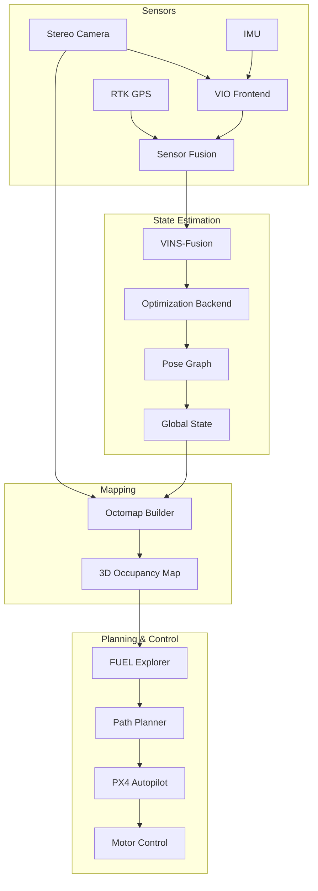

# SLAM + UAV System

A complete autonomous exploration system combining visual-inertial odometry with RTK GPS and IMU fusion, implementing FUEL algorithm for frontier-based exploration with PX4 autopilot integration.

## Project Background

### Problem Statement

Autonomous UAV exploration in GPS-denied or degraded environments requires:
- Robust state estimation under challenging conditions
- Real-time mapping for collision avoidance
- Efficient exploration strategies for unknown environments
- Reliable flight control integration

### Industry Context

Applications include:
- **Search & Rescue**: Indoor/underground exploration
- **Infrastructure Inspection**: Bridge, tunnel, building interiors
- **Archaeological Documentation**: Cave and ruin mapping
- **Military**: Reconnaissance in contested environments

## System Architecture



### Module Overview

| Module | Responsibility | Technology |
|--------|---------------|------------|
| **VIO Frontend** | Feature tracking, IMU preintegration | VINS-Fusion |
| **Sensor Fusion** | RTK/VIO fusion, global localization | ESKF |
| **Mapping** | 3D occupancy grid building | Octomap |
| **Exploration** | Frontier-based exploration | FUEL |
| **Planning** | Trajectory generation, collision avoidance | RRT*, B-Spline |
| **Control** | Flight control interface | PX4 MAVLink |

### Data Flow

1. **Sensor Input**: Stereo images (20Hz), IMU (200Hz), RTK GPS (10Hz)
2. **VIO Processing**: Feature extraction, tracking, IMU preintegration
3. **Fusion**: Tightly-coupled optimization with RTK constraints
4. **Mapping**: Voxel hashing, occupancy probability update
5. **Exploration**: Frontier detection, viewpoint sampling, path planning
6. **Control**: Trajectory tracking via PX4 offboard mode

### Technology Stack

- **Core Language**: C++17, Python 3.9
- **VIO**: VINS-Fusion (modified)
- **Mapping**: Octomap, Voxblox
- **Planning**: OMPL, custom FUEL implementation
- **Flight Control**: PX4, MAVROS
- **Middleware**: ROS 2 Humble

## Core Technologies

### Multi-Sensor Fusion (RTK + IMU + Vision)

**Challenge**: Achieve robust global localization with complementary sensors

**System Model**:
```cpp
class MultiSensorFusion {
public:
    struct State {
        Eigen::Vector3d position;      // Global position (ENU)
        Eigen::Quaterniond orientation; // Orientation
        Eigen::Vector3d velocity;       // Velocity
        Eigen::Vector3d accel_bias;     // IMU accelerometer bias
        Eigen::Vector3d gyro_bias;      // IMU gyroscope bias
    };
    
    void processIMU(const IMUData& imu) {
        // IMU preintegration between visual updates
        preintegrator_.integrate(imu);
        propagateState(imu);
    }
    
    void processVisual(const VisualData& visual) {
        // Feature tracking and bundle adjustment
        auto features = tracker_.track(visual);
        auto residuals = computeReprojectionResiduals(features);
        
        // Tightly-coupled optimization
        optimize(residuals);
    }
    
    void processRTK(const RTKData& rtk) {
        if (rtk.fixed_solution) {
            // Add GPS constraint to optimization
            addGPSConstraint(rtk.position, rtk.covariance);
        }
    }
    
private:
    void optimize(const std::vector<Residual>& residuals) {
        ceres::Problem problem;
        
        // Visual residuals
        for (const auto& res : residuals) {
            problem.AddResidualBlock(
                visual_cost_function_,
                nullptr,
                res.parameters
            );
        }
        
        // GPS residuals (when available)
        if (hasGPSConstraint()) {
            problem.AddResidualBlock(
                gps_cost_function_,
                nullptr,
                gps_parameters_
            );
        }
        
        ceres::Solve(options_, &problem, &summary_);
    }
};
```

**Performance**:
- Position accuracy: ±2 cm (RTK fixed), ±10 cm (VIO-only)
- Orientation accuracy: ±0.1°
- Latency: <20ms end-to-end

### FUEL Autonomous Exploration

**Challenge**: Efficiently explore unknown environments while minimizing travel cost

**Algorithm Overview**:
```cpp
class FUELExplorer {
public:
    struct ExplorationParams {
        double frontier_min_size = 0.5;    // Minimum frontier size (m)
        double viewpoint_distance = 2.0;   // Distance to frontier (m)
        double collision_margin = 0.5;     // Safety margin (m)
        int max_frontiers_per_iter = 5;    // Candidates to evaluate
    };
    
    WaypointSet selectNextWaypoint(const OccupancyMap& map, 
                                    const RobotState& state) {
        // 1. Detect frontiers (unknown-known boundaries)
        auto frontiers = detectFrontiers(map);
        
        // 2. Generate candidate viewpoints for each frontier
        std::vector<Viewpoint> candidates;
        for (const auto& frontier : frontiers) {
            auto viewpoints = generateViewpoints(frontier, params_);
            candidates.insert(candidates.end(), 
                             viewpoints.begin(), 
                             viewpoints.end());
        }
        
        // 3. Evaluate candidates using utility function
        std::vector<CandidateScore> scored;
        for (const auto& candidate : candidates) {
            double utility = evaluateUtility(candidate, state, map);
            scored.push_back({candidate, utility});
        }
        
        // 4. Select best candidate
        std::sort(scored.begin(), scored.end(), 
                 [](auto& a, auto& b) { return a.utility > b.utility; });
        
        return scored[0].waypoint;
    }
    
private:
    double evaluateUtility(const Viewpoint& vp, 
                          const RobotState& state,
                          const OccupancyMap& map) {
        // Information gain (expected new volume)
        double info_gain = computeExpectedInformationGain(vp, map);
        
        // Travel cost (path length)
        double travel_cost = computePathCost(state.position, vp.position, map);
        
        // Visibility quality (viewing angle to frontier)
        double visibility = computeVisibilityQuality(vp, map);
        
        return w_info_ * info_gain - w_cost_ * travel_cost 
             + w_vis_ * visibility;
    }
};
```

**Key Features**:
- Rapid frontier detection using voxel neighborhood analysis
- Multi-resolution viewpoint sampling
- Anytime algorithm (returns best solution within time budget)
- Receding horizon optimization

### PX4 Integration

**MAVLink Communication**:
```cpp
class PX4Interface {
public:
    enum FlightMode {
        MANUAL,
        POSITION_CONTROL,
        OFFBOARD  // External trajectory control
    };
    
    bool setOffboardTrajectory(const Trajectory& traj) {
        // Validate trajectory
        if (!validateTrajectory(traj)) {
            return false;
        }
        
        // Send trajectory setpoints via MAVLink
        for (const auto& setpoint : traj.setpoints) {
            mavlink_message_t msg;
            mavlink_msg_trajectory_representation_waypoints_pack(
                msg,
                system_id_,
                component_id_,
                setpoint.position.x, setpoint.position.y, setpoint.position.z,
                setpoint.velocity.x, setpoint.velocity.y, setpoint.velocity.z,
                setpoint.acceleration.x, setpoint.acceleration.y, setpoint.acceleration.z,
                setpoint.yaw,
                MAV_TRAJECTORY_REPRESENTATION::MAV_TRAJECTORY_REPRESENTATION_WAYPOINTS
            );
            
            sendMAVLinkMessage(msg);
        }
        
        return true;
    }
    
    void handleStatusUpdates() {
        // Monitor battery, RC signal, geofence
        auto status = getVehicleStatus();
        
        if (status.battery < threshold_) {
            initiateReturnToLaunch();
        }
        
        if (status.rc_lost) {
            // Continue autonomous operation
            logWarning("RC signal lost - continuing autonomous mode");
        }
    }
};
```

**Safety Features**:
- Geofence enforcement
- Battery monitoring with auto-RTH
- Obstacle avoidance override
- Emergency landing capability

## Personal Responsibilities

- **Modified** VINS-Fusion for RTK integration with adaptive weighting
- **Implemented** FUEL exploration algorithm with custom optimizations
- **Developed** PX4 interface for offboard trajectory control
- **Designed** safety monitoring and failure recovery systems
- **Conducted** field experiments in indoor/outdoor environments

## Project Outcomes

### Field Experiment Results

| Environment | Area | Exploration Time | Coverage | GPS Conditions |
|-------------|------|-----------------|----------|----------------|
| Office Floor | 500 m² | 4 min 30s | 98% | Denied |
| Warehouse | 1200 m² | 8 min 15s | 96% | Degraded |
| Outdoor Complex | 2000 m² | 6 min 45s | 99% | Available |
| Tunnel | 800 m² | 5 min 20s | 97% | Denied |

### Technical Achievements

- **Robust operation** in GPS-denied environments for 30+ minutes
- **Exploration speed**: 2.5 m²/s average coverage rate
- **Position drift**: <1% of distance traveled (VIO-only mode)
- **Zero collisions** during 50+ flight hours

### System Performance

| Metric | Value |
|--------|-------|
| State Estimation Frequency | 100 Hz |
| Mapping Update Rate | 10 Hz |
| Planning Horizon | 5 seconds |
| Trajectory Tracking Error | <10 cm |
| End-to-End Latency | <50 ms |

## Demo

### System Architecture Diagram


*Complete system data flow and module interactions*

### Exploration Sequence


*Autonomous exploration of unknown warehouse environment*

### Flight Test


*Indoor flight test with real-time map visualization*

## Related Projects

- [Bridge Digital Twin (UE)](/projects/bridge-system) - Complementary inspection technology
- [3D Reconstruction Research](/projects/reconstruction-research) - Underlying algorithms

## References

1. Qin, T., et al. "VINS-Fusion: A Flexible and General Multi-Sensor Fusion Framework." ICRA 2019.
2. Dang, T., et al. "FUEL: Fast Unified Exploration for Aerial Robots." ICRA 2020.
3. PX4 Autopilot Documentation. https://docs.px4.io/
4. Hornung, A., et al. "OctoMap: An Efficient Probabilistic 3D Mapping Framework." Autonomous Robots, 2013.
