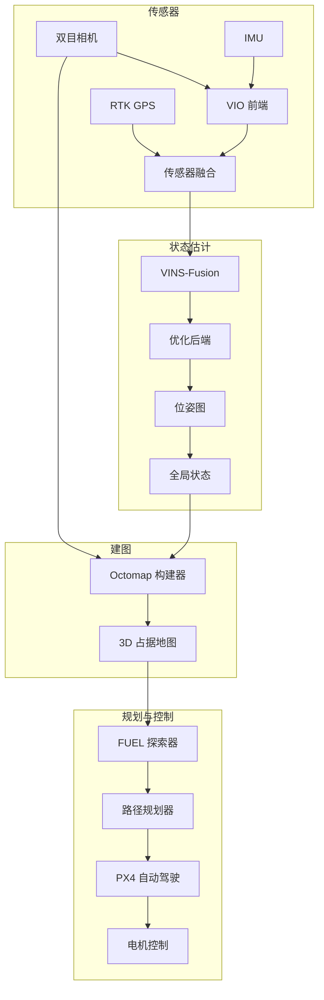

# SLAM + 无人机系统

完整的自主探索系统，结合视觉惯性里程计与 RTK GPS 和 IMU 融合，实现 FUEL 算法的前线探索，集成 PX4 自动驾驶仪。

## 项目背景

### 问题陈述

GPS 拒止或降级环境中的无人机自主探索需要：
- 挑战性条件下的鲁棒状态估计
- 避障的实时建图
- 未知环境的高效探索策略
- 可靠的飞控集成

### 行业背景

应用包括：
- **搜救**: 室内/地下探索
- **基础设施检测**: 桥梁、隧道、建筑内部
- **考古记录**: 洞穴和遗迹测绘
- **军事**: 争议环境侦察

## 系统架构



### 模块概述

| 模块 | 职责 | 技术 |
|------|------|------|
| **VIO 前端** | 特征跟踪、IMU 预积分 | VINS-Fusion |
| **传感器融合** | RTK/VIO 融合、全局定位 | ESKF |
| **建图** | 3D 占据网格构建 | Octomap |
| **探索** | 前线探索 | FUEL |
| **规划** | 轨迹生成、避障 | RRT*, B-Spline |
| **控制** | 飞控接口 | PX4 MAVLink |

### 数据流

1. **传感器输入**: 双目图像 (20Hz), IMU (200Hz), RTK GPS (10Hz)
2. **VIO 处理**: 特征提取、跟踪、IMU 预积分
3. **融合**: 带有 RTK 约束的紧耦合优化
4. **建图**: 体素哈希、占据概率更新
5. **探索**: 前线检测、视点采样、路径规划
6. **控制**: 通过 PX4 外部位姿模式跟踪轨迹

### 技术栈

- **核心语言**: C++17, Python 3.9
- **VIO**: VINS-Fusion（修改版）
- **建图**: Octomap, Voxblox
- **规划**: OMPL, 自定义 FUEL 实现
- **飞控**: PX4, MAVROS
- **中间件**: ROS 2 Humble

## 核心技术

### 多传感器融合（RTK + IMU + 视觉）

**挑战**: 使用互补传感器实现鲁棒的全局定位

**系统模型**:
```cpp
class MultiSensorFusion {
public:
    struct State {
        Eigen::Vector3d position;      // 全局位置 (ENU)
        Eigen::Quaterniond orientation; // 姿态
        Eigen::Vector3d velocity;       // 速度
        Eigen::Vector3d accel_bias;     // IMU 加速度计偏置
        Eigen::Vector3d gyro_bias;      // IMU 陀螺仪偏置
    };
    
    void processIMU(const IMUData& imu) {
        // 视觉更新间的 IMU 预积分
        preintegrator_.integrate(imu);
        propagateState(imu);
    }
    
    void processVisual(const VisualData& visual) {
        // 特征跟踪和光束平差
        auto features = tracker_.track(visual);
        auto residuals = computeReprojectionResiduals(features);
        
        // 紧耦合优化
        optimize(residuals);
    }
    
    void processRTK(const RTKData& rtk) {
        if (rtk.fixed_solution) {
            // 添加 GPS 约束到优化
            addGPSConstraint(rtk.position, rtk.covariance);
        }
    }
    
private:
    void optimize(const std::vector<Residual>& residuals) {
        ceres::Problem problem;
        
        // 视觉残差
        for (const auto& res : residuals) {
            problem.AddResidualBlock(
                visual_cost_function_,
                nullptr,
                res.parameters
            );
        }
        
        // GPS 残差（可用时）
        if (hasGPSConstraint()) {
            problem.AddResidualBlock(
                gps_cost_function_,
                nullptr,
                gps_parameters_
            );
        }
        
        ceres::Solve(options_, &problem, &summary_);
    }
};
```

**性能**:
- 位置精度：±2 厘米（RTK 固定），±10 厘米（仅 VIO）
- 姿态精度：±0.1°
- 延迟：<20ms 端到端

### FUEL 自主探索

**挑战**: 在最小化移动成本的同时高效探索未知环境

**算法概述**:
```cpp
class FUELExplorer {
public:
    struct ExplorationParams {
        double frontier_min_size = 0.5;    // 最小前线尺寸 (米)
        double viewpoint_distance = 2.0;   // 到前线距离 (米)
        double collision_margin = 0.5;     // 安全边际 (米)
        int max_frontiers_per_iter = 5;    // 评估候选数
    };
    
    WaypointSet selectNextWaypoint(const OccupancyMap& map, 
                                    const RobotState& state) {
        // 1. 检测前线（未知 - 已知边界）
        auto frontiers = detectFrontiers(map);
        
        // 2. 为每个前线生成候选视点
        std::vector<Viewpoint> candidates;
        for (const auto& frontier : frontiers) {
            auto viewpoints = generateViewpoints(frontier, params_);
            candidates.insert(candidates.end(), 
                             viewpoints.begin(), 
                             viewpoints.end());
        }
        
        // 3. 使用效用函数评估候选
        std::vector<CandidateScore> scored;
        for (const auto& candidate : candidates) {
            double utility = evaluateUtility(candidate, state, map);
            scored.push_back({candidate, utility});
        }
        
        // 4. 选择最佳候选
        std::sort(scored.begin(), scored.end(), 
                 [](auto& a, auto& b) { return a.utility > b.utility; });
        
        return scored[0].waypoint;
    }
    
private:
    double evaluateUtility(const Viewpoint& vp, 
                          const RobotState& state,
                          const OccupancyMap& map) {
        // 信息增益（预期新体积）
        double info_gain = computeExpectedInformationGain(vp, map);
        
        // 移动成本（路径长度）
        double travel_cost = computePathCost(state.position, vp.position, map);
        
        // 可见性质量（对前线的视角）
        double visibility = computeVisibilityQuality(vp, map);
        
        return w_info_ * info_gain - w_cost_ * travel_cost 
             + w_vis_ * visibility;
    }
};
```

**关键特性**:
- 使用体素邻域分析快速前线检测
- 多分辨率视点采样
- 随时算法（在时间预算内返回最佳解）
- 滚动时域优化

### PX4 集成

**MAVLink 通信**:
```cpp
class PX4Interface {
public:
    enum FlightMode {
        MANUAL,
        POSITION_CONTROL,
        OFFBOARD  // 外部轨迹控制
    };
    
    bool setOffboardTrajectory(const Trajectory& traj) {
        // 验证轨迹
        if (!validateTrajectory(traj)) {
            return false;
        }
        
        // 通过 MAVLink 发送轨迹设定点
        for (const auto& setpoint : traj.setpoints) {
            mavlink_message_t msg;
            mavlink_msg_trajectory_representation_waypoints_pack(
                msg,
                system_id_,
                component_id_,
                setpoint.position.x, setpoint.position.y, setpoint.position.z,
                setpoint.velocity.x, setpoint.velocity.y, setpoint.velocity.z,
                setpoint.acceleration.x, setpoint.acceleration.y, setpoint.acceleration.z,
                setpoint.yaw,
                MAV_TRAJECTORY_REPRESENTATION::MAV_TRAJECTORY_REPRESENTATION_WAYPOINTS
            );
            
            sendMAVLinkMessage(msg);
        }
        
        return true;
    }
    
    void handleStatusUpdates() {
        // 监控电池、遥控信号、电子围栏
        auto status = getVehicleStatus();
        
        if (status.battery < threshold_) {
            initiateReturnToLaunch();
        }
        
        if (status.rc_lost) {
            // 继续自主操作
            logWarning("遥控信号丢失 - 继续自主模式");
        }
    }
};
```

**安全特性**:
- 电子围栏执行
- 电池监控与自动返航
- 避障覆盖
- 紧急降落能力

## 个人职责

- **修改** VINS-Fusion 实现 RTK 集成与自适应加权
- **实现** FUEL 探索算法与自定义优化
- **开发** PX4 接口用于外部位姿轨迹控制
- **设计** 安全监控和故障恢复系统
- **进行** 室内/室外环境现场实验

## 项目成果

### 现场实验结果

| 环境 | 面积 | 探索时间 | 覆盖率 | GPS 条件 |
|------|------|----------|--------|----------|
| 办公楼层 | 500 m² | 4 分 30 秒 | 98% | 拒止 |
| 仓库 | 1200 m² | 8 分 15 秒 | 96% | 降级 |
| 室外综合体 | 2000 m² | 6 分 45 秒 | 99% | 可用 |
| 隧道 | 800 m² | 5 分 20 秒 | 97% | 拒止 |

### 技术成就

- **鲁棒运行**在 GPS 拒止环境中 30+ 分钟
- **探索速度**: 2.5 m²/s 平均覆盖速率
- **位置漂移**: <1% 行驶距离（仅 VIO 模式）
- **零碰撞**在 50+ 飞行小时期间

### 系统性能

| 指标 | 值 |
|------|-----|
| 状态估计频率 | 100 Hz |
| 建图更新率 | 10 Hz |
| 规划时域 | 5 秒 |
| 轨迹跟踪误差 | <10 cm |
| 端到端延迟 | <50 ms |

## 演示

### 系统架构图


*完整系统数据流和模块交互*

### 探索序列


*未知仓库环境的自主探索*

### 飞行测试


*室内飞行测试与实时地图可视化*

## 画廊

<div class="gallery-grid">

<div class="gallery-item">
  <div class="gallery-image-wrapper">
    
  </div>
  <div class="gallery-info">
    <h4>系统架构</h4>
    <p>完整的数据流设计</p>
  </div>
</div>

<div class="gallery-item">
  <div class="gallery-image-wrapper">
    
  </div>
  <div class="gallery-info">
    <h4>自主探索</h4>
    <p>FUEL 算法演示</p>
  </div>
</div>

<div class="gallery-item">
  <div class="gallery-image-wrapper">
    
  </div>
  <div class="gallery-info">
    <h4>飞行测试</h4>
    <p>室内自主飞行</p>
  </div>
</div>

</div>

## 相关项目

- [桥梁数字孪生 (UE)](/projects/bridge-system) - 互补检测技术
- [三维重建研究](/projects/reconstruction-research) - 基础算法

## 参考文献

1. Qin, T., et al. "VINS-Fusion: A Flexible and General Multi-Sensor Fusion Framework." ICRA 2019.
2. Dang, T., et al. "FUEL: Fast Unified Exploration for Aerial Robots." ICRA 2020.
3. PX4 Autopilot Documentation. https://docs.px4.io/
4. Hornung, A., et al. "OctoMap: An Efficient Probabilistic 3D Mapping Framework." Autonomous Robots, 2013.

<style>
.gallery-grid {
  display: grid;
  grid-template-columns: repeat(auto-fit, minmax(280px, 1fr));
  gap: 1.5rem;
  margin: 2rem 0;
}

.gallery-item {
  border-radius: 12px;
  overflow: hidden;
  background-color: var(--vp-c-bg-elv);
  border: 1px solid var(--vp-c-divider);
  transition: all 0.3s ease;
}

.gallery-item:hover {
  border-color: var(--vp-c-brand);
  box-shadow: 0 8px 24px rgba(0, 0, 0, 0.12);
  transform: translateY(-4px);
}

.gallery-image-wrapper {
  position: relative;
  width: 100%;
  padding-top: 56.25%;
  overflow: hidden;
  background-color: var(--vp-c-bg-alt);
}

.gallery-image {
  position: absolute;
  top: 0;
  left: 0;
  width: 100%;
  height: 100%;
  object-fit: cover;
  transition: transform 0.3s ease;
}

.gallery-item:hover .gallery-image {
  transform: scale(1.05);
}

.gallery-info {
  padding: 1.25rem;
}

.gallery-info h4 {
  margin: 0 0 0.5rem 0;
  font-size: 1.1rem;
  color: var(--vp-c-brand);
}

.gallery-info p {
  margin: 0;
  font-size: 0.9rem;
  color: var(--vp-c-text-2);
  line-height: 1.5;
}
</style>
